## Overview of IDS and types of IDS

### What is an IDS?
Một IDS hoạt động bằng cách giám sát network traffic, system logs và các thông tin liên quan khác để xác định, phân tích các mẫy tấn công và cảnh báo về chúng. IDS có thể phát hiện các mẫu tấn công đã biết hoặc các mẫu tấn công mới thông qua việc so sánh các dữ liệu thu thập được với các mẫu tấn công đã biết.

Mục đích của IDS là phát hiện và cảnh báo về các mối đe dọa tiền ẩn trên hệ thống mạng. Khi moojtIDS nhận diện một mẫu tấn công, nó sẽ tạo ra một cảnh báo và thông báo cho người quản trị hệ thống.

### Types of IDS
Có hai loại IDS chính: Network-based IDS (NIDS) và Host-based IDS (HIDS). Sự khác nhau chính giữa NIDS và HIDS phạm vi giám sát và hành vi mà chúng phát hiện. Theo bảng sau:
| Feature               | Network-based IDS (NIDS) | Host-based IDS (HIDS) | 
|-----------------------|--------------------------|-----------------------|
| Monitoring Scope      | Network traffic          | System logs           |
| Deployment Location   | Network perimeter        | Individual hosts      |
| Resource Usage        | Lower                    | Higher                |
| Detection Capability  | Network attacks          | Host-based attacks    |
| Popular tools         | Suricata, Snort          | Wazuh, OSSEC          |

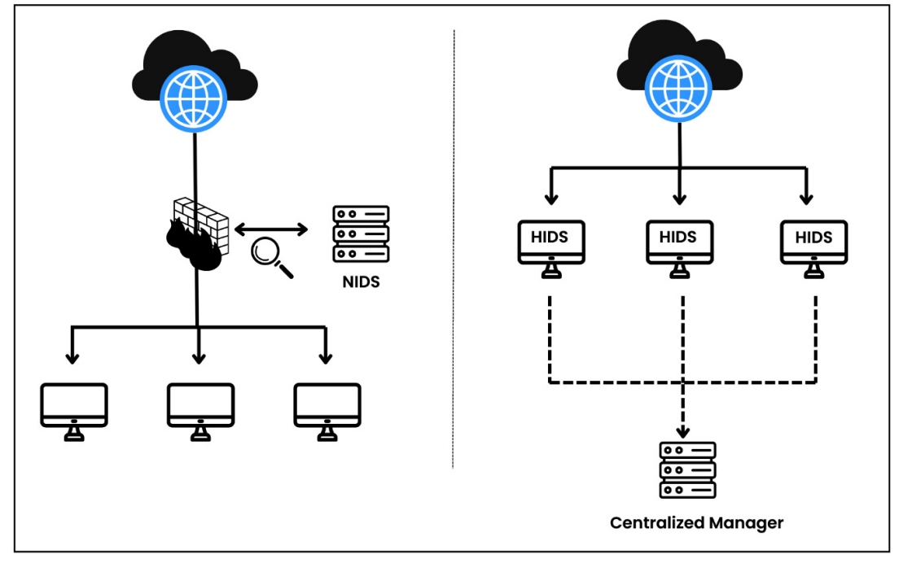

## Introduction to Suricata and its role in IDS
### What is Suricata?

Suricata is open-source network-based IDS, IPS. It is intended to monitor network traffic and detect a variety of threats, including intrusion attempts, malware, and other malicious activities. Suricata is capable of performing real-time traffic analysis and packet logging on IP networks.

Suricata can also be deployed IPS in order to detect and block malicious traffic. Although IPS deployment might sound like the obvious choice, it is important to note that Suricata is primarily designed as an IDS. It often blocks legitimate traffic, which can lead to false positives. Therefore, it is recommended to use Suricata as an IDS.

Download Suricata from the official website: https://suricata.io/

There are multiple use cases of Suricata IDS; some of them are as follows:

- **Network traffic monitoring**: Suricata analyzes real-time network traffic for threats and anomalies. It can detect malicious activities, such as port scanning, brute force attacks, and DDoS attacks.
- **Signature-based detection**: Suricata detects known attack patterns or signatures by checking network traffic against a library of rules and patterns that have already been identified as malicious. We will use Suricata ruleset created by the **Emerging Threats (ET)** community. This ruleset can help us detect known malware, virues, web-based attacks (SQLi, XSS), and other malicious activities.
- **Protocol analysis**: Suricata can deeply examine many different network technologies, such as HTTP, SMTP, DNS and TLS. It can discover anomalous behaviors of protocols, such as HTTP requests, DNS tunneling and unexpected protocol usage.
- **Logging and alerting**: Suricata keeps logs and send out alert when it detects possible threats. These alerts can be used to get security teams to act right away, or they can added to SIEM sysems so that they can be analyzed further and linked to other security events. Wazuh, splunk, ELK stack and all the popolar SIEM solutions  support intergration with the Suricata IDS.

## How organizations use Suricata as an IDS

There are several ways organizations can use Suricata as an IDS. Some of the most common use cases are as follows:
- **Inline deployment at network perimeter**: Suricata can be deployed between the internal network and the external internet connection, actively monitoring and scrutinizing all incoming and outgoing traffic in real time. It can be deployed as a physical appliance or as a virtual machine. The network traffic passes through SUricata, which analyzes the packets and acts based on the criteria that have been defined.

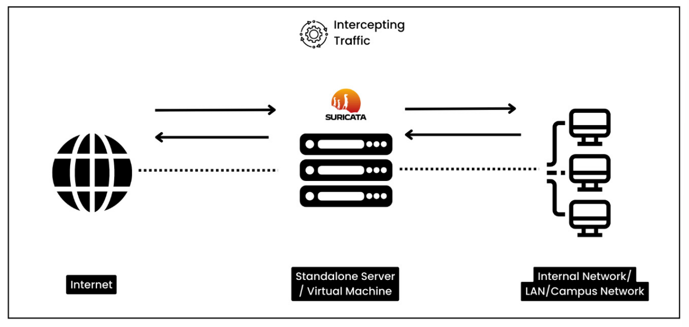

- **Internal network monitoring**: Suricata sensors are strategically located within the internal network in order to capture network traffic between segments or department. These sensors could be physical or virtual devices. They analyze captured traffic and transmit alerts or records to a centralized management console.

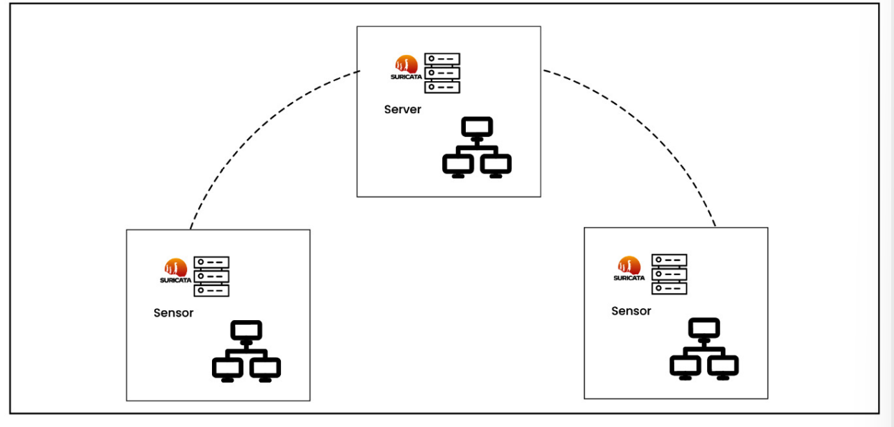

- **Cloud environment monitoring**:
- **Network tap deployment**: Suricata is used in conjunction with network taps or port mirroring to monitor network traffic. Taps are strategically located at key network nodes to caprure a coppy of network traffic from a network link to a monitoring port. This allows Suricata to analyze the copied traffic without affecting the original network traffic. This deployment ensures accurate and comprehensive network activity monitoring.

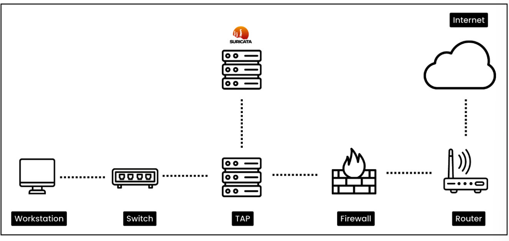

## Wazuh administration, core components, and modules

### Getting started with Wazuh and Suricata

Wazuh is an open-source security monitoring platform that provides **extended detection and response (XDR)** and SIEM functionality. Wazuh's capabilities include log analysis, intrusion detection, vulnerability detection, and real-time alerting, helping organnizations enhance their security posture and respond to threats effectively. In this section, we will first get a basic understanding of the Wazuhplatform and its core components and deployment methods, and then we willset up the Wazuh agent and connect with the Wazuh platform. Next, we willset up a Suricata IDS and integrate it with the
Wazuh agent

### The core components of Wazuh

Wazuh provides a centralized platfrom for monitoring and managin security events across the orgainzation's IT infrastructure. Wazuh collects, analyzes, and connects log data from diffrent sources such as endpoints, network devices, firewalls, proxy servers, and cloud services. Once the logs are collected, Wazuh provides serveral capabilities to the security team such as file integrity monitoring, malware detection, vulnerability detection, command monitoring, system inventory, threat hunting, security configuration assessment, and incident response. The Wazuh solution is made up of three main parts: the Wazuh server, the Wazuh indexer, and the Wazuh dashboard. The Wazuh agent is installed on the endpoints that need to be monitored.

#### Wazuh server

Wazuh server is the core component of the Wazuh platform. It is used to manage the agent and analyze the data received from them:
- **Data collection**: It collects logs from serveral sources such as hosts, network devices, firewalls, proxy servers, and syslog servers.
- **Normalizes and standardizes logs**: It normalizes and standardizes the logs received from the agents. It ultilizes the Wazuh decoder to parse logs to display the logs in a uniform format.
- The Wazuh server is capable of integratiing logs from several data source such as syslog, windows event logs, windows sysmon, docker logs, Palo alto firewall logs, and check pint firewall logs.
- The wazuh server also provides an API for intertion, allowing remote servers or system to interact and query, for example, the number of active Wazuh agents, vulnerability information, and agent status.

#### Wazuh Indexer

It is responsible for indexing and storing alerts generated bt the Wazuh server:
- The Wazuh indexer stores alerts sent by the Wazuh server and acts as a primary repository for the alerts.
- It's made to handle a lot of security alerts, making sure that storage and indexing work well as the system grows.

*Note* : Indexing is the process of arranging and arranging data to enable effective search and retrieval of information. It involves creating a data structure caller an index.

- The Wazuh indexer provides robust search features that make it possible to quickly and thoroughly search through saved alerts using particular or patterns.
- The Wazuh indexer uses four index patterns to store data:
    - **wazuh-alerts-***: This is the index pattern for alerts generated by the Wazuh server
    - **wazuh-archives-***: This is the index pattern for all events sent to the Wazuh server.
    - **wazuh-monitoring-***: This is the index pattern for monitoring the status of Wazuh agents.
    - **wazuh-statistics-***: This is the index pattern for storing statistics about the Wazuh server.

#### Wazuh dashboard

The Wazuh dashboard is a web interface that allows you to perform visualization and analysis. It also
allows you to create rules, monitor events, monitor regulatory compliances (such as PCI DSS, GDPR,
CIS, HIPPA, and NIST 800-53), detect vulnerable applications, and much more.

#### Wazuh agent

Wazuh agent are installed on the endpoints such as servers desktops laptops, and cloud instances that need to be monitored. Wazuh ultilizes the OSSEC HIDS module to collect all the endpoint events.

***Note***: OSSEC is a popular and open-source HIDS. It is a powerful  collection and analysis module that integrates log analysis, file integrity monitoring, Windows registry monitoring, centralized policy enforcement, rootkit detection, real-time alerting, and active response. It can be installed on most OS such as Linux, Windows, OpenBSD, FreeBSD, and Windows

Wazuh is known for its ability to fully monitor security and detect threats. It also has several flexible deployment options. Depending on your requirement, you can deploy Wazuh in an on-premises server, cloud, Docker container, Kubernetes, or another environment. For a production environment, Wazuh core components (i.e., the Wazuh server, the Wazuh indexer, and the Wazuh dashboard) should be installed in cluster mode. Cluster mode deployment involves setting up more than one Wazuh server node to work collectively. By spreading the work and duties among several nodes in the cluster, this configuration aims to improve speed, scalability, and resilience. Let’s cover some important deployment options:

- **Servers**: Putting Wazuh on dedicated servers gives you more power and lets you make changes that work with your system. You can ultilizes on-permises servers or cloud instances. 
=> Remember, you need multiple servers instances to deploy Wazuh in cluster mode for production environments to ensure high availability and scalability.

- **VM image**: Wazuh gives an Open virtual appliance (OVA) formated VM image is already setup. This can be imported straight into virtualBox, VMware, or other virtualization software that works with OVA files. You can use this deployment option to test all the scenarios mentioned in this book. Download the OVA file from here: https://documentation.wazuh.com/current/deployment-options/virtual-machine/virtual-machine.html
=> This is good for a lab purposeonly

- **Docker container**: Docker is an open platform for building and running applications inside an isolated software container. Docker containers are the best way to quickly and easily set up Wazuh components in independent environments. You can download the Docker image from the link here: https://hub.docker.com/u/wazuh
=> This option is commonly used for testing, development, or situations where setup and takedown need to be done quickly. Not optimal for production environments because of the lack of scalability and high availability.

- **Deployment on Kubernetes**: Kubernetes is an open-source container orchestration platform. You can opt for this method when managing large-scale deployment with multiple containers. This method gives you higher scalability, automated deployment, and resource optimization. You can check out the Wazuh Kubernetes repository at the following link: https://github.com/wazuh/wazuh-kubernetes.

If you want to test all the use cases throughout the book, I suggest you use the Wazuh VM deployment option by downloading the OVA file; however, for the production-level deployment, you can choose any of the remaining options. The Wazuh community has done a brilliant job in documenting the installation guide. You can refer to this link for step-by-step assistance: https://documentation.wazuh.com/current/installation-guide/index.html.


### Wazuh modules

Wazuh has a set of modules that work together to help organizations handle security events, find threats, make sure they are following the rules, and keep their systems and data safe. Once you access the Wazuh manager, the topmost option is Modules. By default, you can find multiple modules categorized under four sections as mentioned in the following diagram:

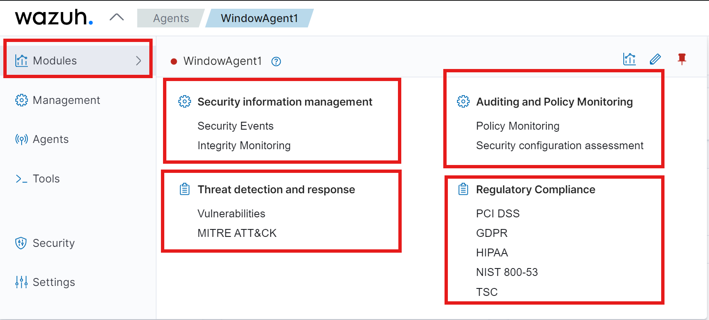

Let's discuss the modules in detail:
- **Security information management**: This consists of the Security Events and Integrity Monitoring module. Security alerts will be triggered and displayed based on predefined Wazuh rules for identified security events. The Integrity Monitoring module monitors any unauthorized changes to critical system files and directories.
- **Threat detection and response**: By default, this section has two modules: Vulnerabilities and MITREATT&CK®. However, you can also add Osquery, VirusTotal, and more. The Vulnerabilities module identifies, and tracks known vulnerabilities in the systems or software. The MITREATT&CK module maps detected threats or incidents to the MITRE ATT&CK framework.

*Note*: ATT&CK stands for Adversarial Tactics, Techniques, and Common Knowledge. It is a knowledge base of adversary tactics and techniques based on real-world observations. It is used as a foundation for the development of specific threat models and methodologies in the private sector, government, and the cybersecurity product and service community. MITRE is a government-funded research organization that operates multiple federally funded research and development centers (FFRDCs). MITRE ATT&CK is a globally accessible knowledge base of adversary tactics and techniques based on real-world observations. The ATT&CK is a framework that helps organizations with attacker's tactics, techniques. and procedures (TTPs) to test their security controls and defenses.


### Wazuh Administration

The Administration section includes capabilities such as Rules, Decoders, CBD lists, Groups, and configuration
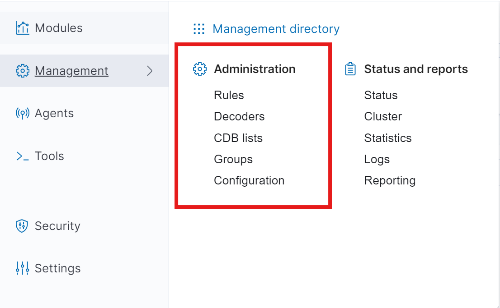

**Decoders**

Decoders are responsible for reading incoming log entries, pulling out the important information, and putting them into a standard format that the Wazuh system can easily understand and analyze. Raw log entries can be in different formats, such as syslog, JSON, XML, or custom text format. There are many pre-built decoders in Wazuh such as the syslog decoder, OpenSSH decoder, Suricata decoder, and the Cisco ASA decoder. To understand what decoders are and how they work, let us look at how logs from the Barracuda WAF are processed:
```js
<decoder name="barracuda-svf1">
    <parent>barracuda-svf-email</parent>
    <prematch>^\S+[\S+]|</prematch>
    <prematch>^\S+</prematch>
    <regex>^\S+[(\S+)] (\d+-\w+-\w+) \d+ \d+ |</regex>
    <regex>^(\S+) (\d+-\w+-\w+) \d+ \d+ </regex>
    <order>srcip, id</order>
</decoder>
```
Let's break down the parts of this Wazuh decoder:
```js
- <decoder name="barracuda-svf1">: This is the name of the decoder. It is used to identify the decoder in the Wazuh system.
- <parent>barracuda-svf-email</parent>: This gives us the name of the parent decoder. The parent decoder will be processed before the child decoders.
- <prematch>^\S+[\S+]|</prematch>:  This is like a condition that must match to apply the decoder. It uses regular expressions to look for a match.
- <regex>^\S+[(\S+)] (\d+-\w+-\w+) \d+ \d+ |</regex>: This represents the regular expression to extract data. In the preceding decoder, we have two regex instances
- <order>srcip, id</order>: This indicates the list of fields in which the extracted information or value will be stored.
```

There are tons of other options available for Wazuh rules. I would suggest you check out the Rules Syntax page at the following link: https://documentation.wazuh.com/current/user-manual/ruleset/rulesetxml-syntax/rules.html) in the Wazuh documentation.

**CDB lists**

The Constant Database (CDB) list enables the categorization and management of IP addresses and domains based on their characteristics. These lists can include known malicious IP addresses, suspicious domains, trusted IP addresses, whitelisted domains, and more. Admins maintain these lists by adding or removing entries based on reputation or risk levels. To learn more about CDB lists, you can visit the official Wazuh documentation for CDB lists: https://documentation.wazuh.com/current/usermanual/ruleset/cdb-list.html.

**Groups**

**Configuration**


### Installing the Wazuh server

The Wazuh server is the central component of the Wazuh security platform. It consists of two important elements: the Wazuh manager and Filebeat. The Wazuh manager collects and analyzes data from the Wazuh agents and triggers alerts when it detects any threats. Filebeat forwards alerts and events to the Wazuh indexer. The Wazuh server can be installed in multiple ways, however, I’d recommend the multinode cluster method for a production environment and the VM method for a lab environment. You can follow the guidelines for both methods in the following sections.

#### For a production environment

To setu wazuh in the production environment, it is recommented to deploy the Wazuh server and Wazuh indexer on different hosts. This helps you handle traffic from a large number of endpoints and also to achieve high availability. The step-by-step guide to install the Wazuh server along with the indexer and dashboard is mentioned here: https://documentation.wazuh.com/current/installationguide/index.html.

#### For a lab environment


### Installing Wazuh agent

#### Installing a Wazuh agent on Ubuntu Server

To deploy a Wazuh agent on the Ubuntu Server, you need to install the agent and configure the deployment variables. To get started with installation, you need to log in to your Wazuh dashboard, navigate to Agents, click on Deploy an agent and then follow these steps:

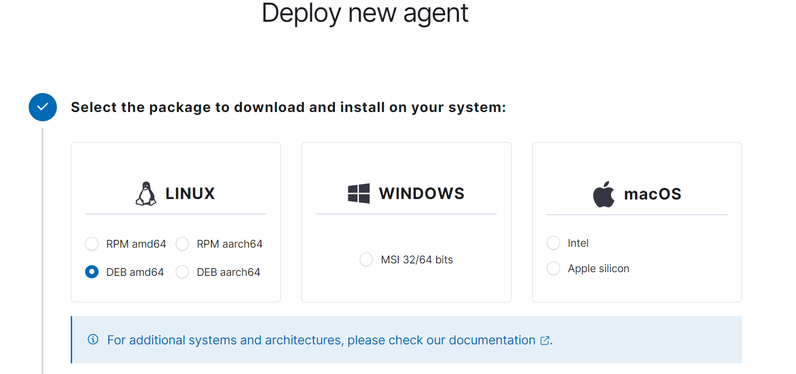

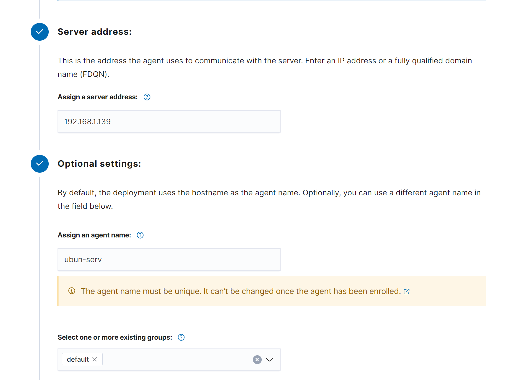

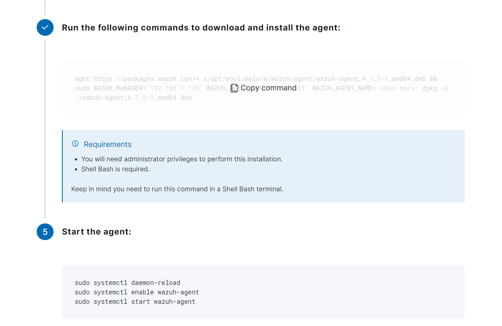

Let's break down what we've inputted: 
- 192.168.1.139: This is the IP address of the Wazuh server.
- ubu-serv: name of the wazuh agent.
- default: This is the group name. You can create a new group or use the default group.

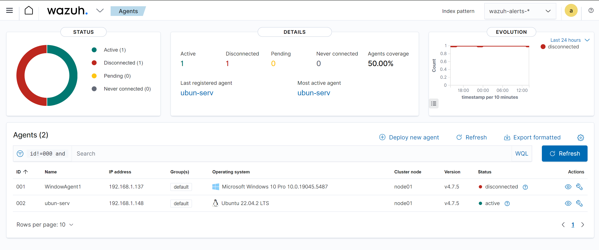

***NOTE*** Make sure that there are no firewall rules blocking communication between the agent and the Wazuh manager. The agent should be able to communicate with the manager over the configured port (the default is 1514/514 for syslog).

### Installing Suricata on Ubuntu Server

#### Installation
1. Install Suricata using the following command:
```bash
sudo add-apt-repository ppa:oisf/suricata-stable # Add the Suricata PPA
sudo apt-get update                             # Update the package list
sudo apt-get install suricata                   # Install Suricata
```
2. Install the ET Open ruleset: The ET Suricata ruleset comprises a compilation of rules created for the Suricata IDS. We are required to store all the rules in the /etc/suricata/rules directory:
```bash 
cd /tmp/ && curl -LO https://rules.emergingthreats.net/open/suricata/emerging.rules.tar.gz
sudo mkdir -p /etc/suricata/rules
sudo tar -xvzf emerging.rules.tar.gz && sudo mv rules/*.rules /etc/suricata/rules/
sudo chmod 640 /etc/suricata/rules/*.rules
```
3. Configure Suricata: In order to fine-tune the Suricata configuration, you can edit the /etc/suricata/suricata.yaml file.
```bash
HOME_NET: "<AGENT_IP>"                  # Replace <AGENT_IP> with the IP address of the Wazuh agent or the network range
EXTERNAL_NET: "any"                     # Set any if you want to monitor all the traffic coming from the external network
default-rule-path: /etc/suricata/rules  # Path to the rules directory where the ET Open rules are stored
rule-files:                             # Specify the rules that need to be loaded
  - "*.rules"
af-packet:                              # This is a packet capture method used to capture network traffic directory from a network interface card (NIC). You can check your current NIC by using the ifconfig command and updating the afpacket settings.
  - interface: ens33
```
4. Restart Suricata: After configuring Suricata, restart the Suricata service to apply the changes:
```bash
sudo systemctl restart suricata
sudo systemctl status suricata
```
5. Integrate with Wazuh: : In order for the Wazuh agent to monitor and collect Suricata traffic, we need to specify the Suricata log file location under the Wazuh agent ossec config file located at /var/ossec/etc/ossec.conf. Suricata stores all the logs at /var/log/suricata/eve.json. You are required to mention this file under the <location> tag in the ossec.conf file:
```bash
<ossec_config>
  <localfile>
    <log_format>json</log_format>
    <location>/var/log/suricata/eve.json</location>     # Specify the Suricata log file location
  </localfile>
</ossec_config>
```
6. Restart the Wazuh agent: After configuring the Suricata log file location, restart the Wazuh agent to apply the changes:
```bash
sudo systemctl restart wazuh-agent
sudo systemctl status wazuh-agent
```

### Understanding Suricata rules

Suricata is powerful when you have a set of powerful rules. Although there are thousands of Suricata rule templates available online, it is still important to learn how to create a custom Suricata rule from scratch. In this section, we’ll learn basic Suricata rule syntax and some common use cases with attack and defense.

#### Suricata rule syntax

Suricata uses rules to detect different network event, and when certain conditions are met, it can be set up to do things such as alert or block.

Here’s an overview of the Suricata rule syntax:
```bash
action proto src_ip src_port -> dest_ip dest_port (msg:"Alert message"; content:"string"; sid:12345;)
```
Let’s break down the parts of the Suricata rule:
- **action**: This is the action that Suricata will take when the rule is triggered. The action can be alert, drop, reject, or pass.
- **proto**: This is the protocol that the rule will be applied to. It can be tcp, udp, icmp, or any.
- **src_ip**: This is the source IP address of the traffic.
- **src_port**: This is the source port of the traffic.
- **dest_ip**: This is the destination IP address of the traffic.
- **dest_port**: This is the destination port of the traffic.
- **msg**: This is the message that will be displayed when the rule is triggered.
- **content**: This is the content that Suricata will look for in the traffic.
- **sid**: This is the unique ID of the rule.


### Network scanning probe attack and detection

Network scanning is the initialstage of most hacking exercises, and the most powerful tool used for this purpose is none other than the Nmap scanner. Nmap is a free and open source Linux command-line tool. Nmap helps us to scan any host to discover opened ports, software versions, OSs, and so on. It is used by security professionals for security testing, network exploration, and vulnerability detection. Threat actors also perform network scanning to discover any open ports, software versions, or vulnerability packages. In this section, we will initiate network scanning probes using the Nmap tool against our Wazuh agent (running Suricata services). The ET ruleset already consists of rules to detect Nmap-based scanning probes. We will verify it using this attack scenario.

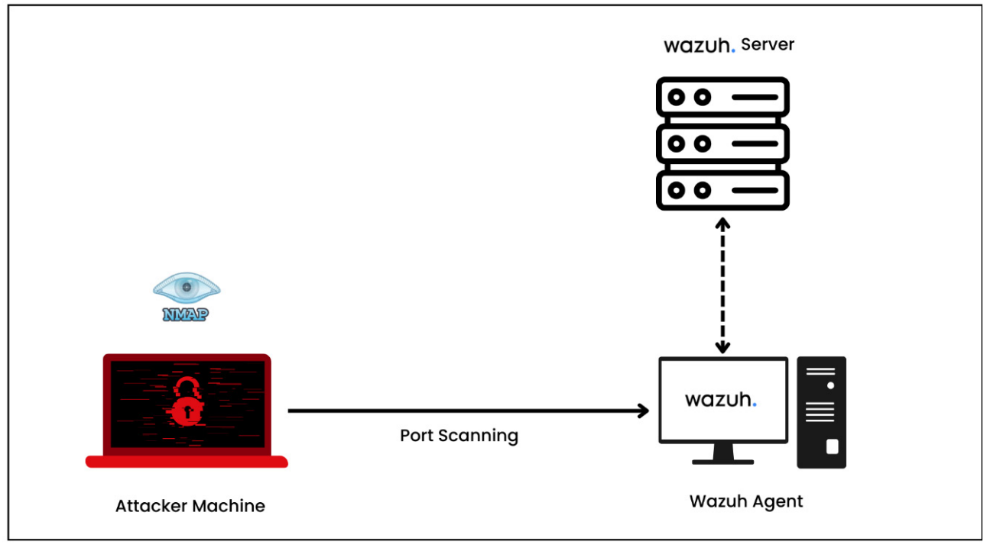

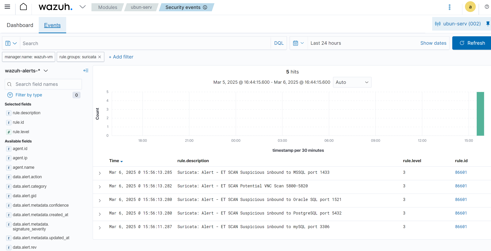

### Testing web-based attacks using DVWA
#### Lab setup

We will be installing a DVWA application on a Debian-based Linux distribution.

**Installation Requirements**
- **Operating System**: Debian-based system (Kali, Ubuntu, Kubuntu, Linux Mint, Zorin OS)
- **Privilege**s: Execute as root user

**Installation Steps**

*One-Liner*

This will download an install script written by @IamCarron and run it automatically. This would not be included here if we did not trust the author and the script as it was when we reviewed it, but there is always the chance of someone going rogue, and so if you don't feel safe running someone else's code without reviewing it yourself, follow the manual process and you can review it once downloaded.

```bash
sudo bash -c "$(curl --fail --show-error --silent --location https://raw.githubusercontent.com/IamCarron/DVWA-Script/main/Install-DVWA.sh)"
```

*Manually Running the Script*

1. Download the script:
``` bash 
wget https://raw.githubusercontent.com/IamCarron/DVWA-Script/main/Install-DVWA.sh
```
2. Make the script executable:
``` bash 
chmod +x Install-DVWA.sh
```
3. Run the script as root:
```bash 
sudo ./Install-DVWA.sh
```

#### Testing SQL injection attacks

On Attacker's machine, insert the payload in the DVWA application to test the SQL injection attack. The payload is as follows:
```
http://<DVWA_IP_ADDRESS>/DVWA/vulnerabilities/sqli/?id=a' UNION SELECT "Hello","Hello Again";-- -&Submit=Submit
```
```
http://<DVWA_IP_ADDRESS>/DVWA/vulnerabilities/sqli/?id='' UNION SELECT first_name,password FROM users -- ';
```
```
http://<DVWA_IP_ADDRESS>/DVWA/vulnerabilities/sqli/?id=' OR 1=1 -- ';
```
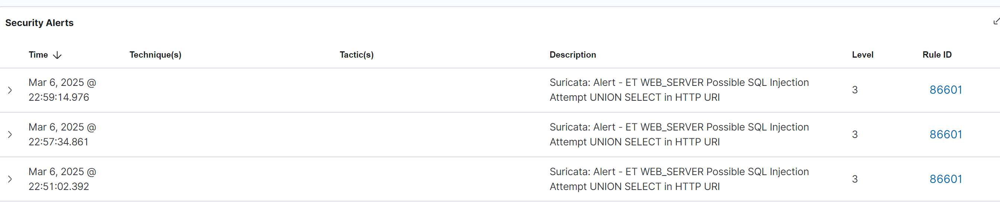

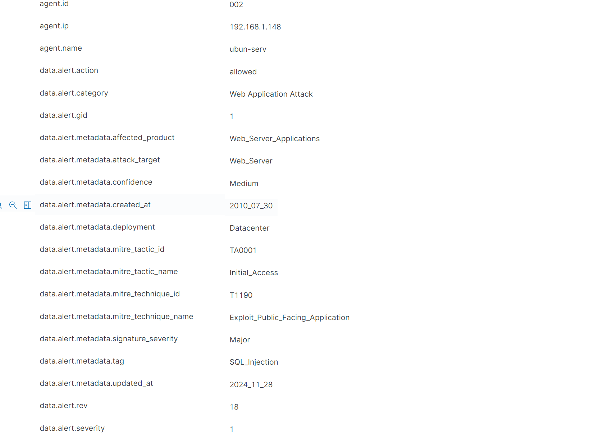

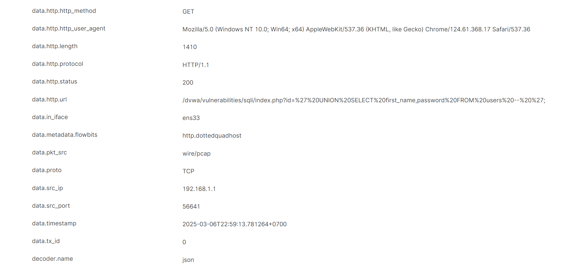

#### Testing XSS attacks

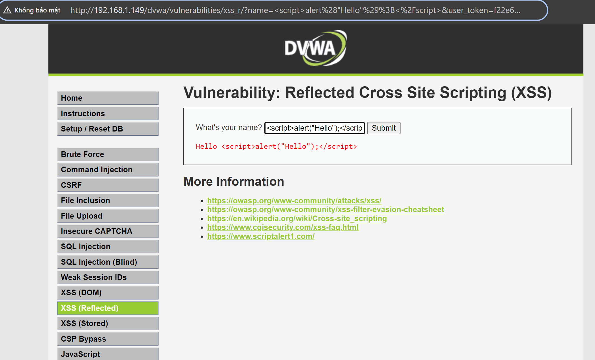

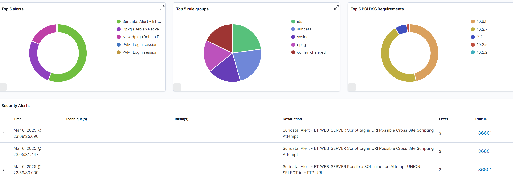

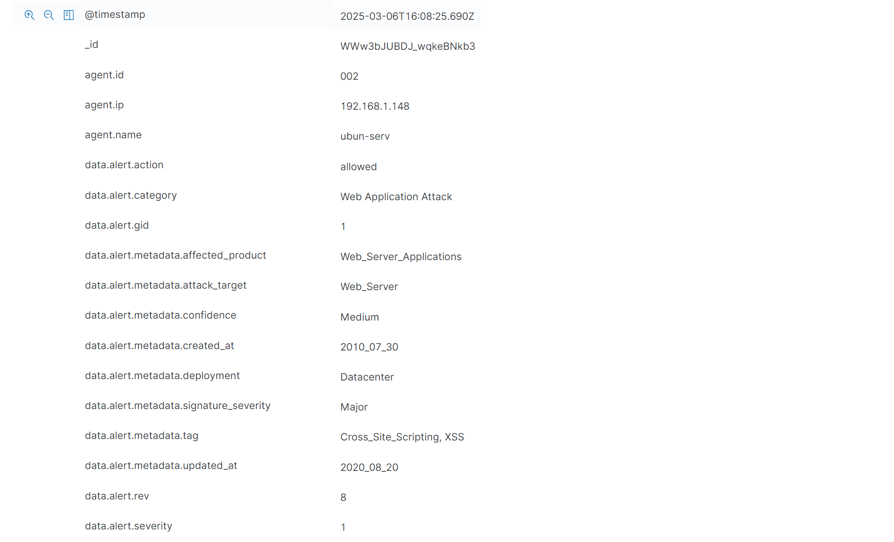

#### Testing NIDS with tmNIDS

We have two devices: Ubuntu Server running the Wazuh agent, Suricata IDS, and
tmNIDS, and second, the Wazuh server

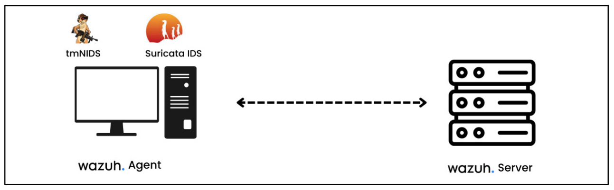

Install tmNIDS on Ubuntu Server

The source code of the tmNIDS project is published on GitHub (https://github.com/3CORESec/testmynids.org). To install tmNIDS, we can run a curl command to download the packages:
```bash
curl -sSL https://raw.githubusercontent.com/3CORESec/testmynids.org/master/tmNIDS -o /tmp/tmNIDS && chmod +x /tmp/tmNIDS && /tmp/tmNIDS
```


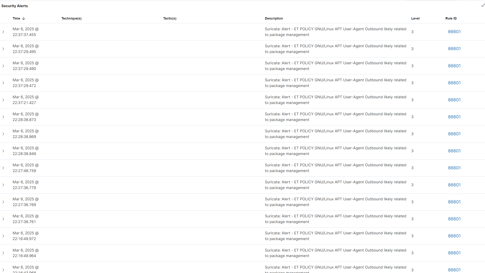