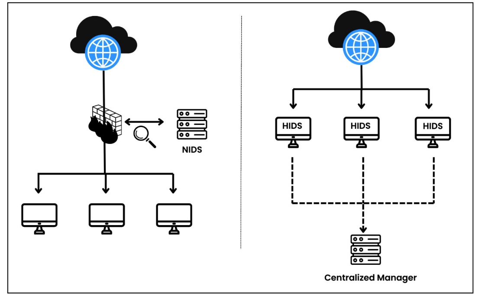
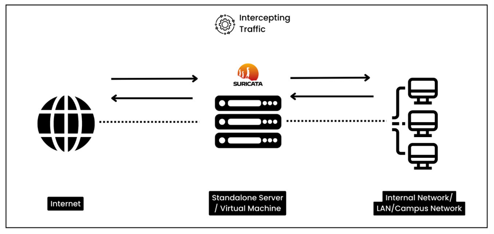
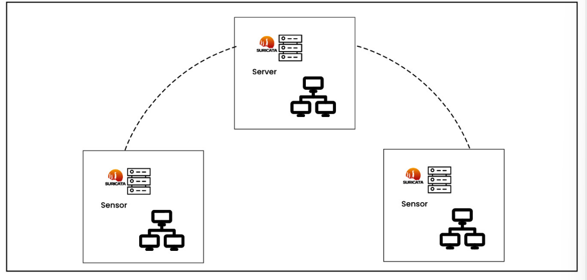
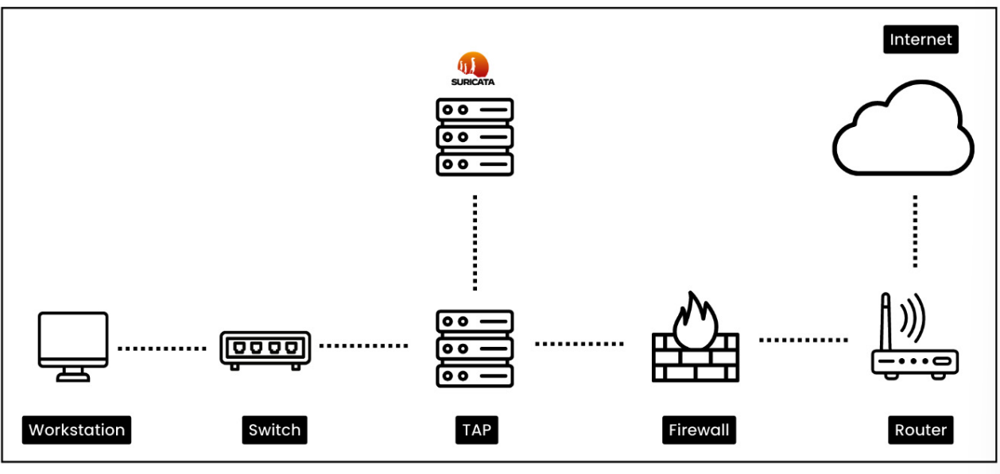
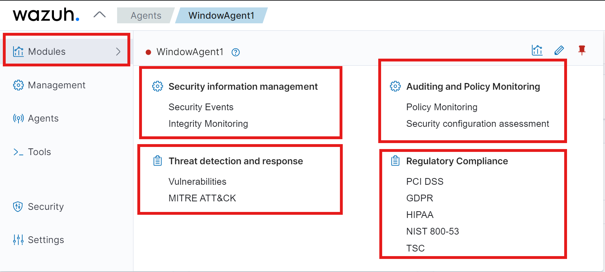
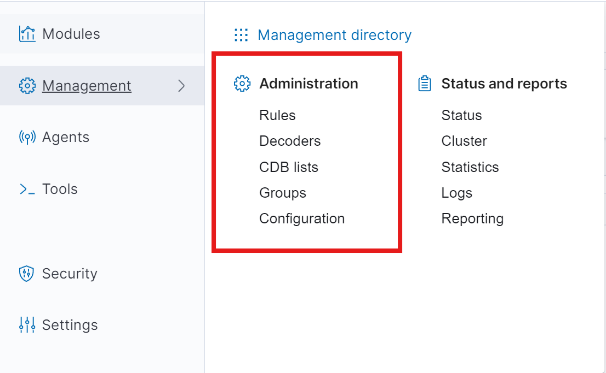
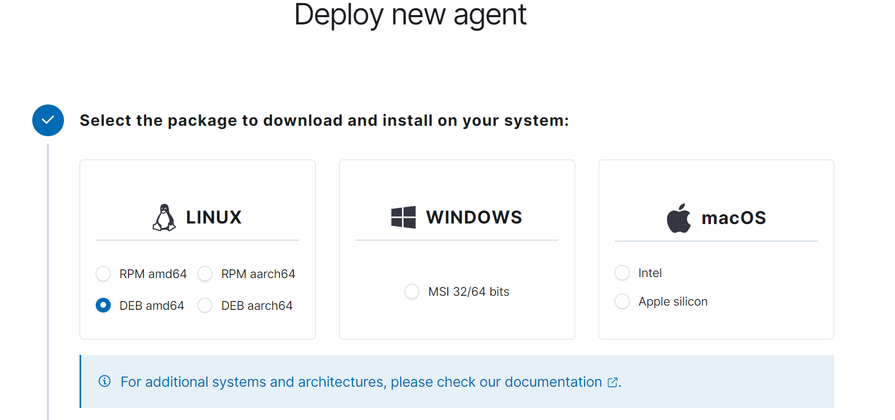
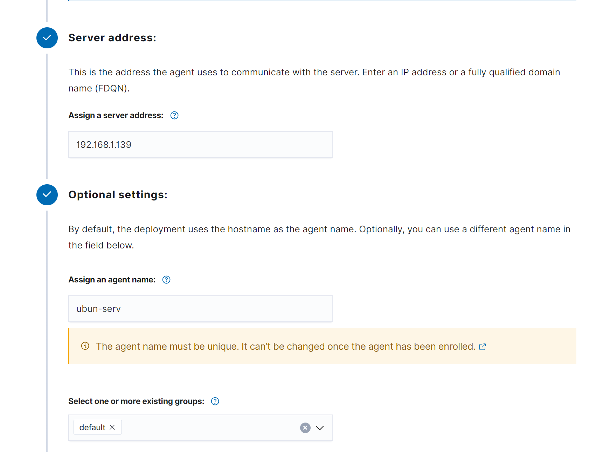
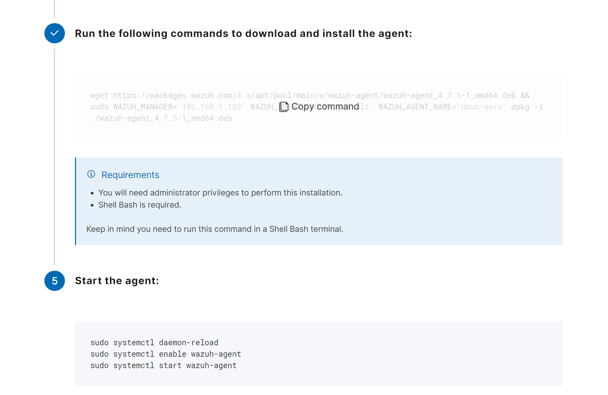

## What is an IDS?
Một IDS hoạt động bằng cách giám sát network traffic, system logs và các thông tin liên quan khác để xác định, phân tích các mẫy tấn công và cảnh báo về chúng. IDS có thể phát hiện các mẫu tấn công đã biết hoặc các mẫu tấn công mới thông qua việc so sánh các dữ liệu thu thập được với các mẫu tấn công đã biết.

Mục đích của IDS là phát hiện và cảnh báo về các mối đe dọa tiền ẩn trên hệ thống mạng. Khi moojtIDS nhận diện một mẫu tấn công, nó sẽ tạo ra một cảnh báo và thông báo cho người quản trị hệ thống.

## Types of IDS
Có hai loại IDS chính: Network-based IDS (NIDS) và Host-based IDS (HIDS). Sự khác nhau chính giữa NIDS và HIDS phạm vi giám sát và hành vi mà chúng phát hiện. Theo bảng sau:
| Feature               | Network-based IDS (NIDS) | Host-based IDS (HIDS) | 
|-----------------------|--------------------------|-----------------------|
| Monitoring Scope      | Network traffic          | System logs           |
| Deployment Location   | Network perimeter        | Individual hosts      |
| Resource Usage        | Lower                    | Higher                |
| Detection Capability  | Network attacks          | Host-based attacks    |
| Popular tools         | Suricata, Snort          | Wazuh, OSSEC          |

## What is Suricata?

Suricata is open-source network-based IDS, IPS. It is intended to monitor network traffic and detect a variety of threats, including intrusion attempts, malware, and other malicious activities. Suricata is capable of performing real-time traffic analysis and packet logging on IP networks.

Suricata can also be deployed IPS in order to detect and block malicious traffic. Although IPS deployment might sound like the obvious choice, it is important to note that Suricata is primarily designed as an IDS. It often blocks legitimate traffic, which can lead to false positives. Therefore, it is recommended to use Suricata as an IDS.

Download Suricata from the official website: https://suricata.io/

There are multiple use cases of Suricata IDS; some of them are as follows:

- **Network traffic monitoring**: Suricata analyzes real-time network traffic for threats and anomalies. It can detect malicious activities, such as port scanning, brute force attacks, and DDoS attacks.
- **Signature-based detection**: Suricata detects known attack patterns or signatures by checking network traffic against a library of rules and patterns that have already been identified as malicious. We will use Suricata ruleset created by the **Emerging Threats (ET)** community. This ruleset can help us detect known malware, virues, web-based attacks (SQLi, XSS), and other malicious activities.
- **Protocol analysis**: Suricata can deeply examine many different network technologies, such as HTTP, SMTP, DNS and TLS. It can discover anomalous behaviors of protocols, such as HTTP requests, DNS tunneling and unexpected protocol usage.
- **Logging and alerting**: Suricata keeps logs and send out alert when it detects possible threats. These alerts can be used to get security teams to act right away, or they can added to SIEM sysems so that they can be analyzed further and linked to other security events. Wazuh, splunk, ELK stack and all the popolar SIEM solutions  support intergration with the Suricata IDS.

## How organizations use Suricata as an IDS

There are several ways organizations can use Suricata as an IDS. Some of the most common use cases are as follows:
- **Inline deployment at network perimeter**: Suricata can be deployed between the internal network and the external internet connection, actively monitoring and scrutinizing all incoming and outgoing traffic in real time. It can be deployed as a physical appliance or as a virtual machine. The network traffic passes through SUricata, which analyzes the packets and acts based on the criteria that have been defined.

- **Internal network monitoring**: Suricata sensors are strategically located within the internal network in order to capture network traffic between segments or department. These sensors could be physical or virtual devices. They analyze captured traffic and transmit alerts or records to a centralized management console.

- **Cloud environment monitoring**:
- **Network tap deployment**: Suricata is used in conjunction with network taps or port mirroring to monitor network traffic. Taps are strategically located at key network nodes to caprure a coppy of network traffic from a network link to a monitoring port. This allows Suricata to analyze the copied traffic without affecting the original network traffic. This deployment ensures accurate and comprehensive network activity monitoring.

## Getting started with Wazuh and Suricata

Wazuh is an open-source security monitoring platform that provides **extended detection and response (XDR)** and SIEM functionality. Wazuh's capabilities include log analysis, intrusion detection, vulnerability detection, and real-time alerting, helping organnizations enhance their security posture and respond to threats effectively. In this section, we will first get a basic understanding of the Wazuhplatform and its core components and deployment methods, and then we willset up the Wazuh agent and connect with the Wazuh platform. Next, we willset up a Suricata IDS and integrate it with the
Wazuh agent

### The core components of Wazuh

Wazuh provides a centralized platfrom for monitoring and managin security events across the orgainzation's IT infrastructure. Wazuh collects, analyzes, and connects log data from diffrent sources such as endpoints, network devices, firewalls, proxy servers, and cloud services. Once the logs are collected, Wazuh provides serveral capabilities to the security team such as file integrity monitoring, malware detection, vulnerability detection, command monitoring, system inventory, threat hunting, security configuration assessment, and incident response. The Wazuh solution is made up of three main parts: the Wazuh server, the Wazuh indexer, and the Wazuh dashboard. The Wazuh agent is installed on the endpoints that need to be monitored.

#### Wazuh server

Wazuh server is the core component of the Wazuh platform. It is used to manage the agent and analyze the data received from them:
- **Data collection**: It collects logs from serveral sources such as hosts, network devices, firewalls, proxy servers, and syslog servers.
- **Normalizes and standardizes logs**: It normalizes and standardizes the logs received from the agents. It ultilizes the Wazuh decoder to parse logs to display the logs in a uniform format.
- The Wazuh server is capable of integratiing logs from several data source such as syslog, windows event logs, windows sysmon, docker logs, Palo alto firewall logs, and check pint firewall logs.
- The wazuh server also provides an API for intertion, allowing remote servers or system to interact and query, for example, the number of active Wazuh agents, vulnerability information, and agent status.

#### Wazuh Indexer

It is responsible for indexing and storing alerts generated bt the Wazuh server:
- The Wazuh indexer stores alerts sent by the Wazuh server and acts as a primary repository for the alerts.
- It's made to handle a lot of security alerts, making sure that storage and indexing work well as the system grows.

*Note* : Indexing is the process of arranging and arranging data to enable effective search and retrieval of information. It involves creating a data structure caller an index.

- The Wazuh indexer provides robust search features that make it possible to quickly and thoroughly search through saved alerts using particular or patterns.
- The Wazuh indexer uses four index patterns to store data:
    - **wazuh-alerts-***: This is the index pattern for alerts generated by the Wazuh server
    - **wazuh-archives-***: This is the index pattern for all events sent to the Wazuh server.
    - **wazuh-monitoring-***: This is the index pattern for monitoring the status of Wazuh agents.
    - **wazuh-statistics-***: This is the index pattern for storing statistics about the Wazuh server.

#### Wazuh dashboard

The Wazuh dashboard is a web interface that allows you to perform visualization and analysis. It also
allows you to create rules, monitor events, monitor regulatory compliances (such as PCI DSS, GDPR,
CIS, HIPPA, and NIST 800-53), detect vulnerable applications, and much more.

#### Wazuh agent

Wazuh agent are installed on the endpoints such as servers desktops laptops, and cloud instances that need to be monitored. Wazuh ultilizes the OSSEC HIDS module to collect all the endpoint events.

***Note***: OSSEC is a popular and open-source HIDS. It is a powerful  collection and analysis module that integrates log analysis, file integrity monitoring, Windows registry monitoring, centralized policy enforcement, rootkit detection, real-time alerting, and active response. It can be installed on most OS such as Linux, Windows, OpenBSD, FreeBSD, and Windows

Wazuh is known for its ability to fully monitor security and detect threats. It also has several flexible deployment options. Depending on your requirement, you can deploy Wazuh in an on-premises server, cloud, Docker container, Kubernetes, or another environment. For a production environment, Wazuh core components (i.e., the Wazuh server, the Wazuh indexer, and the Wazuh dashboard) should be installed in cluster mode. Cluster mode deployment involves setting up more than one Wazuh server node to work collectively. By spreading the work and duties among several nodes in the cluster, this configuration aims to improve speed, scalability, and resilience. Let’s cover some important deployment options:

- **Servers**: Putting Wazuh on dedicated servers gives you more power and lets you make changes that work with your system. You can ultilizes on-permises servers or cloud instances. 
=> Remember, you need multiple servers instances to deploy Wazuh in cluster mode for production environments to ensure high availability and scalability.

- **VM image**: Wazuh gives an Open virtual appliance (OVA) formated VM image is already setup. This can be imported straight into virtualBox, VMware, or other virtualization software that works with OVA files. You can use this deployment option to test all the scenarios mentioned in this book. Download the OVA file from here: https://documentation.wazuh.com/current/deployment-options/virtual-machine/virtual-machine.html
=> This is good for a lab purposeonly

- **Docker container**: Docker is an open platform for building and running applications inside an isolated software container. Docker containers are the best way to quickly and easily set up Wazuh components in independent environments. You can download the Docker image from the link here: https://hub.docker.com/u/wazuh
=> This option is commonly used for testing, development, or situations where setup and takedown need to be done quickly. Not optimal for production environments because of the lack of scalability and high availability.

- **Deployment on Kubernetes**: Kubernetes is an open-source container orchestration platform. You can opt for this method when managing large-scale deployment with multiple containers. This method gives you higher scalability, automated deployment, and resource optimization. You can check out the Wazuh Kubernetes repository at the following link: https://github.com/wazuh/wazuh-kubernetes.

If you want to test all the use cases throughout the book, I suggest you use the Wazuh VM deployment option by downloading the OVA file; however, for the production-level deployment, you can choose any of the remaining options. The Wazuh community has done a brilliant job in documenting the installation guide. You can refer to this link for step-by-step assistance: https://documentation.wazuh.com/current/installation-guide/index.html.

### Wazuh modules

Wazuh has a set of modules that work together to help organizations handle security events, find threats, make sure they are following the rules, and keep their systems and data safe. Once you access the Wazuh manager, the topmost option is Modules. By default, you can find multiple modules categorized under four sections as mentioned in the following diagram:

Let’s discuss the modules in detail:
- **Security information management**: This consists of the Security Events and Integrity Monitoring module. Security alerts will be triggered and displayed based on predefined Wazuh rules for identified security events. The Integrity Monitoring module monitors any unauthorized changes to critical system files and directories.
- **Threat detection and response**: By default, this section has two modules: Vulnerabilities and MITREATT&CK®. However, you can also add Osquery, VirusTotal, and more. The Vulnerabilities module identifies, and tracks known vulnerabilities in the systems or software. The MITREATT&CK module maps detected threats or incidents to the MITRE ATT&CK framework.

### Wazuh Administration

### Installing the Wazuh server

### Installing Wazuh agent

### Installing Suricata on Ubuntu Server

### Understanding Suricata rules

### Suricata rule syntax

### Network scanning probe attack and detection

### Testing web-based attacks using DVWA

### Lab setup

## Understanding Suricata rules