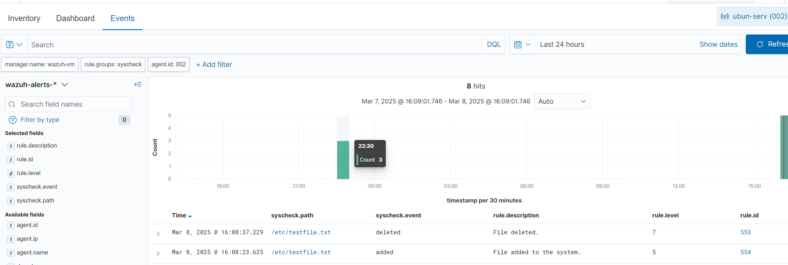
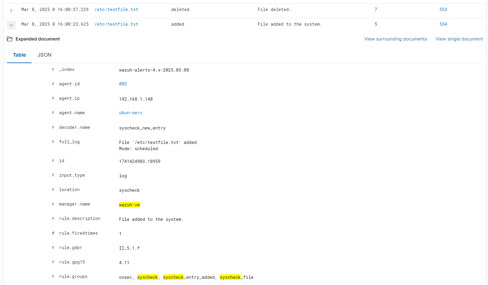

# Malware Detection using Wazuh

Malware is short for malicious software, and it is installed on a computer without the user’s permission. Attackers can use malware to encrypt, steal computer data, or spy on system activity. Malware detection is a process of monitoring and analyzing computer systems and networks for the presence of malicious software and files. Security products detect malware by matching the signature of known malware samples and also by monitoring anomalous behavior. However, some malware can evade detection using multiple techniques once it enters the system. Wazuh utilizes a wide range of approaches to address and counter those techniques to detect malicious files and suspicious activities. In this chapter, we will learn about different Wazuh modules to detect malicious files and integrate some third-party tools to enhance its detection capabilities.

In this chapter, we’ll cover the following topics:
- Types of malware
- Wazuh’s capabilities for malware detection
- Malware detection using file integrity monitoring(FIM)
- VirusTotal Integration
- The CDB list
- Integrating Windows Defender logs
- Integrating System Monitor (Sysmon) to detect fileless malware

## 1. Types of Malware

Malware can be classified into different categories based on its behavior and the damage it can cause. Here are some common types of malware:

- **Virues**: Malware that attaches itself to a legitimate program and replicates itself when the program is executed. Viruses can cause damage by corrupting or destroying data. Examples include ILOVEYOU, Mydoom, and Anna Kournikova.
- **Worms**: Self-replicating malware that spreads across networks and computers. Worms can cause damage by consuming network bandwidth and degrading system performance. Examples include Code Red, Slammer, and Conficker.
- **Trojans**: Malware that disguises itself as legitimate software to trick users into installing it. Trojans can cause damage by stealing sensitive information, spying on user activity, or providing unauthorized access to the system. Examples include Zeus, Emotet, and Trickbot.
- **Ransomware**: Malware that encrypts files and demands a ransom to decrypt them. Ransomware can cause damage by encrypting critical data and disrupting business operations. Examples include WannaCry, Petya, and Locky.
- **Spyware**: Malware that monitors user activity and collects sensitive information. Spyware can cause damage by stealing passwords, credit card numbers, and other personal data. Examples include FinFisher, FlexiSPY, and Pegasus.
- **Rootkits**: Malware that hides its presence on the system and provides unauthorized access to attackers. Rootkits can cause damage by allowing attackers to control the system and steal sensitive information. Examples include Stuxnet, Duqu, and Flame.

Malware is usually spread through different ways, such as phishing emails, malicious downloads, infected websites, and external devices such as USB drives that have been hacked. Cybercriminals are always changing their methods to avoid being caught and take advantage of new weaknesses. Now, let’s learn about some of the important Wazuh capabilities for malware detection.

## 2. Wazuh's Malware Detection Capabilities

Wazuh offers serveral capabilities that contribute to its effectiveness in detecting malware. This is accomplished through the use of a combination of log analysis intrusion detection and threat intelligence. . It also provides real-time alerting, event correlation, and the ability to execute custom scripts for automated reaction activities, making it a powerful tool for effectively identifying and responding to malware attacks. The following are some of Wazuh’s methods for malware detection:

- **Threat detection rules and FIM**: In this method, Wazuh utilizes it's built-in capability to detect any critical file modifications. Some of the capabilities are:
  - Wazuh employs a set of predefined, continuously monitored threat detection principles. The purpose of principles is to identify suspicious activities, events, and patterns that may indicate malware infections or security breaches.
  - Wazuh's malware detection relies heavily on FIM
- **Rootkit behavior detection**: Wazuh uses the rootcheck function to detect anomalies that might indicate the presence of malware in an endpint:

- **VirusTotal Integration**:
- **YARA Integration**:

## 3. Using FIM for Malware Detection

When a system gets compromised by malwarem, it may create new files or modify existing files, such as the following file types:
- Executable files (.exe, .dll, and .vbs)
- Configuration files (.ini, .cfg)
- Temporary files (.tmp)
- Registry entries
- Log files (.log)
- Payload files
- Hidden files and directory
- Batch scripts (.bat)
- PowerShell scripts (.ps1)
- Specific file types used by malware (.doc, .xls, .pdf)

Using this information, we can create an FIM rule in Wazuh to detect any file changes. However, we will get a high number of false positive alerts, too. To solve this problem, we can focus on a specific directory or folder. We will learn more in this section.

In this section, we’ll learn how to create Wazuh rules to detect some of the common malware patterns. We’ll cover the following use cases: 
- Configuring and testing FIM on an Ubuntu machine
- Detecting suspicious files on a PHP server using the FIM module

### Configuring and Testing FIM on Ubuntu

FIM is a technology that monitors the integrity of system and application files. It safeguards sensitive data, application, and device files by routinely monitoring, scanning, and confirming their integrity. It works by detecting changes to mission-critical files in the network and as a result, it brings down the risk associated with data breaches.

The good news is that Wazuh has a built-in capability for FIM. This is possible because Wazuh uses an Open Source HIDS Security (OSSEC) agent. OSSEC is a free, open-source host-based intrusion detection system. When a user or process creates, modifies, or deletes a monitored file, the Wazuh FIM module initiates an alert. Let’s understand a file integrity check by setting up a FIM module on an Ubuntu machine. In order to test this use case, you need to follow these steps.

**Step 1: Setting up the Wazuh agent on an Ubuntu machine**

By default, FIM module is enabled on the Wazuh agent. The configuration of the FIM module is present in the <syscheck> tag under the ossec.conf file located at /var/ossec/etc. We only need to add directories (to be monitored) under the <syscheck> block. The following configuration will monitor specified files and directories for any types of changes or modifications:

```xml
<syscheck>
  <disabled>no</disabled>
  <frequency>720</frequency>
  <scan_on_start>yes</scan_on_start>
  <directories check_all="yes" report_changes="yes" real_time="yes">/etc,/bin,/sbin</directories>
  <directories check_all="yes" report_changes="yes" real_time="yes">/lib,/lib64,/usr/lib,/usr/lib64</directories>
  <directories check_all="yes" report_changes="yes" real_time="yes">/var/www,/var/log,/var/named</directories>
  <ignore>/etc/mtab</ignore>
  <ignore>/etc/hosts.deny</ignore>
  <ignore>/etc/mail/statistics</ignore>
  <ignore>/etc/random-seed</ignore>
  <ignore>/etc/adjtime</ignore>
  <ignore>/etc/httpd/logs</ignore>
  <ignore>/etc/utmpx</ignore>
  <ignore>/etc/wtmpx</ignore>
  <ignore>/etc/cups/certs</ignore>
  <ignore>/etc/dumpdates</ignore>
  <ignore>/etc/svc/volatile</ignore>
  <ignore>/sys/kernel/security</ignore>
  <ignore>/sys/kernel/debug</ignore>
  <ignore>/sys</ignore>
  <ignore>/dev</ignore>
  <ignore>/tmp</ignore>
  <ignore>/proc</ignore>
  <ignore>/var/run</ignore>
  <ignore>/var/lock</ignore>
  <ignore>/var/run/utmp</ignore>
</syscheck>
```
**Step 2 – Restart the Wazuh agent**

After adding the directories to be monitored, restart the Wazuh agent using the following command:

```bash
sudo systemctl restart wazuh-agent
```

**Step 3 – Testing the FIM module**

To test the FIM module, create a new file in the monitored directory. For example, create a new file in the /var/www directory using the following command:

```bash
sudo touch /etc/testfile.txt
sudo echo "This is a test file" > /etc/testfile.txt
sudo rm /etc/testfile.txt
```

To visualize the alerts, you can navigate to Security Alerts or the Integrity Monitoring module in the
Wazuh dashboard and check for the file-added alerts as shown in the following figure:






### Detecting Suspicious Files on a PHP Server with FIM

## 4. CDB Lists and How They Work

## 5. Installing Wazuh Server and Configuring Windows Endpoints

## 6. Testing and Displaying Alerts

## 7. Integration with VirusTotal

### Installing and Integrating VirusTotal with Wazuh

### Creating Rules on Wazuh Manager

### Testing and Displaying Alerts

## 8. Integration with Windows Defender Logs

### Configuring Wazuh Agent to Collect Windows Defender Logs

### Testing and Displaying Alerts

## 9. Integration with Sysmon for Fileless Malware Detection

### Installing Sysmon on Windows

### Configuring Wazuh to Monitor Sysmon Events

### Testing and Displaying Alerts

## 10. Summary