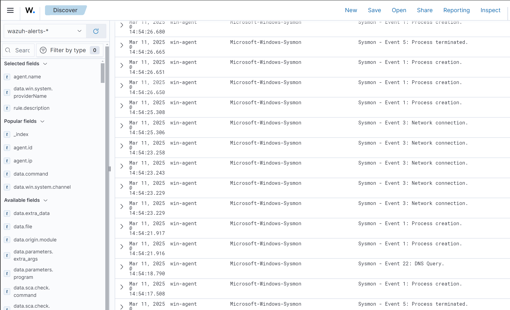

# Malware Detection using Wazuh

Malware is short for malicious software, and it is installed on a computer without the user’s permission. Attackers can use malware to encrypt, steal computer data, or spy on system activity. Malware detection is a process of monitoring and analyzing computer systems and networks for the presence of malicious software and files. Security products detect malware by matching the signature of known malware samples and also by monitoring anomalous behavior. However, some malware can evade detection using multiple techniques once it enters the system. Wazuh utilizes a wide range of approaches to address and counter those techniques to detect malicious files and suspicious activities. In this chapter, we will learn about different Wazuh modules to detect malicious files and integrate some third-party tools to enhance its detection capabilities.

In this chapter, we’ll cover the following topics:
- Types of malware
- Wazuh’s capabilities for malware detection
- Malware detection using file integrity monitoring(FIM)
- VirusTotal Integration
- The CDB list
- Integrating Windows Defender logs
- Integrating System Monitor (Sysmon) to detect fileless malware

## 1. Types of Malware

Malware can be classified into different categories based on its behavior and the damage it can cause. Here are some common types of malware:

- **Virues**: Malware that attaches itself to a legitimate program and replicates itself when the program is executed. Viruses can cause damage by corrupting or destroying data. Examples include ILOVEYOU, Mydoom, and Anna Kournikova.
- **Worms**: Self-replicating malware that spreads across networks and computers. Worms can cause damage by consuming network bandwidth and degrading system performance. Examples include Code Red, Slammer, and Conficker.
- **Trojans**: Malware that disguises itself as legitimate software to trick users into installing it. Trojans can cause damage by stealing sensitive information, spying on user activity, or providing unauthorized access to the system. Examples include Zeus, Emotet, and Trickbot.
- **Ransomware**: Malware that encrypts files and demands a ransom to decrypt them. Ransomware can cause damage by encrypting critical data and disrupting business operations. Examples include WannaCry, Petya, and Locky.
- **Spyware**: Malware that monitors user activity and collects sensitive information. Spyware can cause damage by stealing passwords, credit card numbers, and other personal data. Examples include FinFisher, FlexiSPY, and Pegasus.
- **Rootkits**: Malware that hides its presence on the system and provides unauthorized access to attackers. Rootkits can cause damage by allowing attackers to control the system and steal sensitive information. Examples include Stuxnet, Duqu, and Flame.

Malware is usually spread through different ways, such as phishing emails, malicious downloads, infected websites, and external devices such as USB drives that have been hacked. Cybercriminals are always changing their methods to avoid being caught and take advantage of new weaknesses. Now, let’s learn about some of the important Wazuh capabilities for malware detection.

## 2. Wazuh's Malware Detection Capabilities

Wazuh offers serveral capabilities that contribute to its effectiveness in detecting malware. This is accomplished through the use of a combination of log analysis intrusion detection and threat intelligence. . It also provides real-time alerting, event correlation, and the ability to execute custom scripts for automated reaction activities, making it a powerful tool for effectively identifying and responding to malware attacks. The following are some of Wazuh’s methods for malware detection:

- **Threat detection rules and FIM**: In this method, Wazuh utilizes it's built-in capability to detect any critical file modifications. Some of the capabilities are:
  - Wazuh employs a set of predefined, continuously monitored threat detection principles. The purpose of principles is to identify suspicious activities, events, and patterns that may indicate malware infections or security breaches.
  - Wazuh's malware detection relies heavily on FIM
- **Rootkit behavior detection**: Wazuh uses the rootcheck function to detect anomalies that might indicate the presence of malware in an endpint:

- **VirusTotal Integration**:
- **YARA Integration**:

## 3. Using FIM for Malware Detection

When a system gets compromised by malwarem, it may create new files or modify existing files, such as the following file types:
- Executable files (.exe, .dll, and .vbs)
- Configuration files (.ini, .cfg)
- Temporary files (.tmp)
- Registry entries
- Log files (.log)
- Payload files
- Hidden files and directory
- Batch scripts (.bat)
- PowerShell scripts (.ps1)
- Specific file types used by malware (.doc, .xls, .pdf)

Using this information, we can create an FIM rule in Wazuh to detect any file changes. However, we will get a high number of false positive alerts, too. To solve this problem, we can focus on a specific directory or folder. We will learn more in this section.

In this section, we’ll learn how to create Wazuh rules to detect some of the common malware patterns. We’ll cover the following use cases: 
- Configuring and testing FIM on an Ubuntu machine
- Detecting suspicious files on a PHP server using the FIM module

### Configuring and Testing FIM on Ubuntu

FIM is a technology that monitors the integrity of system and application files. It safeguards sensitive data, application, and device files by routinely monitoring, scanning, and confirming their integrity. It works by detecting changes to mission-critical files in the network and as a result, it brings down the risk associated with data breaches.

The good news is that Wazuh has a built-in capability for FIM. This is possible because Wazuh uses an Open Source HIDS Security (OSSEC) agent. OSSEC is a free, open-source host-based intrusion detection system. When a user or process creates, modifies, or deletes a monitored file, the Wazuh FIM module initiates an alert. Let’s understand a file integrity check by setting up a FIM module on an Ubuntu machine. In order to test this use case, you need to follow these steps.

**Step 1: Setting up the Wazuh agent on an Ubuntu machine**

By default, FIM module is enabled on the Wazuh agent. The configuration of the FIM module is present in the <syscheck> tag under the ossec.conf file located at /var/ossec/etc. We only need to add directories (to be monitored) under the <syscheck> block. The following configuration will monitor specified files and directories for any types of changes or modifications:

```xml
<syscheck>
  <disabled>no</disabled>
  <frequency>720</frequency>
  <scan_on_start>yes</scan_on_start>
  <directories check_all="yes" report_changes="yes" real_time="yes">/etc,/bin,/sbin</directories>
  <directories check_all="yes" report_changes="yes" real_time="yes">/lib,/lib64,/usr/lib,/usr/lib64</directories>
  <directories check_all="yes" report_changes="yes" real_time="yes">/var/www,/var/log,/var/named</directories>
  <ignore>/etc/mtab</ignore>
  <ignore>/etc/hosts.deny</ignore>
  <ignore>/etc/mail/statistics</ignore>
  <ignore>/etc/random-seed</ignore>
  <ignore>/etc/adjtime</ignore>
  <ignore>/etc/httpd/logs</ignore>
  <ignore>/etc/utmpx</ignore>
  <ignore>/etc/wtmpx</ignore>
  <ignore>/etc/cups/certs</ignore>
  <ignore>/etc/dumpdates</ignore>
  <ignore>/etc/svc/volatile</ignore>
  <ignore>/sys/kernel/security</ignore>
  <ignore>/sys/kernel/debug</ignore>
  <ignore>/sys</ignore>
  <ignore>/dev</ignore>
  <ignore>/tmp</ignore>
  <ignore>/proc</ignore>
  <ignore>/var/run</ignore>
  <ignore>/var/lock</ignore>
  <ignore>/var/run/utmp</ignore>
</syscheck>
```
**Step 2 – Restart the Wazuh agent**

After adding the directories to be monitored, restart the Wazuh agent using the following command:

```bash
sudo systemctl restart wazuh-agent
```

**Step 3 – Testing the FIM module**

To test the FIM module, create a new file in the monitored directory. For example, create a new file in the /var/www directory using the following command:

```bash
sudo touch /etc/testfile.txt
sudo echo "This is a test file" > /etc/testfile.txt
sudo rm /etc/testfile.txt
```

To visualize the alerts, you can navigate to Security Alerts or the Integrity Monitoring module in the
Wazuh dashboard and check for the file-added alerts as shown in the following figure:


Let’s break this down:
- **decoder.name: syscheck_new_entry:** This field represents a new entry related to system checks or FIM that have been detected by the Wazuh agent. In this case, a file has been added.
- **full.log: File '/root/infectedfile.txt'added:** This represents that a new file called testfile.txt has been added.

In this use case, we have learned to detect file changes in /root using the FIM module of Wazuh. In the next section, we will learn to detect possible malware in the PHP server.

### Detecting Suspicious Files on a PHP Server with FIM

PHP is a popular server-side scripting language that is used to develop dynamic web applications. However, PHP servers are vulnerable to malware attacks. Attackers can inject malicious code into PHP files to exploit vulnerabilities and steal sensitive information. The most common PHP file extensions that are targeted by malware are .php, .phtml, .php3, .php4, .php5, .php7, and .phps. 

There files are usually located in the /var/www/html, /var/www/public_html, and /var/www/vhosts directories. In this use case, we will learn to detect suspicious files on a PHP server using the FIM module of Wazuh. To test this use case, you need to follow these steps:

**Create a Wazuh rule**

We will create a custom rule to detect PHP files that have been modified or added on the PHP server. We will add different types of PHP files extensions under the <fied> tag of the rule. We will cover this use case along with testing and finally, we will visualize the alerts on the Wazuh manager:

Create a Wazuh rule to detect PHP file creation or modification.

To create a Wazuh rule, go to Management | Rules and click on Add a new rule. Next, we’ll name it custom_fim.xml and add the following rule:

## 4. CDB Lists and How They Work

The CDB list in Wazuh serves as a repository for distinct hashes or checksums of malicious and benign files. The Wazuh security platform can precisely compare the files’ cryptographic representations on a system and those kept in the CDB. The CDB list consists of lists of users, file hashes, IP addresses, domain names, and so on.

### The working of CDB lists

You can save a list of users, file hashes, IP addresses, and domain names in the text file called a CDB list. A CDB list can have entries added in a **key:value** pair or a **key:only** format. Lists on CDBs can function as allow or deny lists. Wazuh processes the CDB list in the process mentioned here:

1. **Hash generation**: CDB lists consist of hashes of both good and bad content such as IP addresses, malware hashes, and domain names. A hash is a unique fixed-length value generated based on the CDB list content.
2. **File comparison**: Wazuh computes file hashes during a system scan and compares them to the CDB entries.
3. **Identification**: Wazuh marks a file as possibly malicious if its hash matches a known malicious hash in the CDB.
4. **Alers and reaction**: Based on the set policies, Wazuh has the ability to trigger alerts or responses upon detection.

Now we will through the fist practical use case of CDB lists where in we will detect malicious IP addresses using CDB lists.

### Setup Wazuh Server

We need to set up our Wazuh server with the CDB list of malware hashes and create the required rules to trigger alerts when a file with a hash matches CDB malware hashes. We need to follow these steps to accomplish that:

1. **Create a CDB list of malware hashes:** CDB lists are stored in the ```/var/ossec/etc/lists``` directory. We will create a new file called malware_hashes.txt and add some malware hashes to it. The file should look like this:

```bash
nano /var/ossec/etc/lists/malware-hashes.txt
```

2. **Add malware hashes:** We need to enter the known malware hashes in the key:value pair where key will be the actual malware hash and value will be the name or keyword. Now, there are several sources from where we can download and use the malware hashes for the CDB list. One of the popular sources is a list published by Nextron Systems. You can view and download the list from the official GitHub page ```(https://github.com/Neo23x0/signature-base/blob/master/iocs/hash-iocs.txt)```. For testing purposes, we will use a few popular malware hashes such as Mirai and Fanny.

```js
nano /var/ossec/etc/lists/malware-hashes

4fef5e34143e646dbf9907c4374276f5:Sakula
563d1512178cec1f6a73c98d565c98fa:Cygwin
000c907d39924de62b5891f8d0e03116:Darkhotel
```

3. **Add CDB list under the default ruleset** By providing the location of the CDB list in the `<ruleset>` tag, you may add refference to the CDB list in the `var/ossec/etc/lists/malware-hashes` file.

```xml
<ruleset>
<!-- Default ruleset -->
<list>etc/lists/malware-hashes</list>
<ruleset>
```

4. **Create a rule to detect malware hashes:** Create a custom rule in the Wazuh server’s `/var/ossec/etc/rules/local_rules.xml` file. When Wazuh finds a match between the MD5 hash of a recently created or updated file and a malware hash in the CDB list, this rule triggers. When an event occurs that indicates a newly created or modified file exists, rules 554 and 550 will be triggered:

```xml
<group name="malware,">
    <rule id="110002" level="13">
        <if_sid>554, 550</if_sid>
        <list field="md5" lookup="match_key">etc/lists/malware-hashes</list>
        <description>Known Malware File Hash is detected: $(file)</description>
        <mitre>
            <id>T1204.002</id>
        </mitre>
    </rule>
</group>
```


### Installing Wazuh Server and Configuring Windows Endpoints

### Testing and Displaying Alerts

## 5. Integration with VirusTotal

VirusTotal is a free online service that analyzes files and URLs to detect malware and other malicious content. It uses over 70 types of antivirus software and URL blocklisting engineers to provide detailed information about the submitted file, URL, or IP address. VirusTotal allows users to contribute their own findings and submit comments on files and URLs. These contributions can help improve the service’s accuracy and provide valuable insights to other users. VirusTotal provides an API with multiple paid plans. However, it also has a free plan where you can request four lookups per minute with a daily quote of 500 lookups.

In this use case of malware detection, we will use a FIM module to monitor the changes and then trigger VirusTotal to scan the files in that directory. 

### Installing and Integrating VirusTotal with Wazuh

Get the VirusTotal API key and add it to the Wazuh manager


Wazuh has prebuilt VirusTotal integration scripts located in `/var/ossec/integrations`. Now, all you have to do is to call this VirusTotalscript in `/var/ossec/etc/ossec.conf` file, and to do that, add a <integration> tag as shown in the following:
```xml
<ossec_config>
  <integration>
    <name>virustotal</name>
    <api_key><YOUR_VIRUS_TOTAL_API_KEY></api_key> <!-- Replace with your VirusTotal API key -->
    <rule_id>100200,100201</rule_id>
    <alert_format>json</alert_format>
  </integration>
</ossec_config>

### Creating Rules on Wazuh Manager

Now, we want to trigger VirusTotalscanning only when any file is changed, added, or deleted to avoid tons of false positive alerts. We will create an FIM rule with an ID of 100200 and 100201 in the local_rule.xml file located at /var/ossec/etc/rules in the Wazuh manager. The Wazuh rules can be written as shown in the following:

```xml
<group name="syscheck,pci_dss_11.5,nist_800_53_SI.7,">
  <!-- Rules for Linux systems -->
  <rule id="100200" level="7">
    <if_sid>550</if_sid>
    <field name="file">/root</field>
    <description>File modified in /root directory.</description>
  </rule>
  <rule id="100201" level="7">
    <if_sid>554</if_sid>
    <field name="file">/root</field>
    <description>File added to /root directory.</description>
  </rule>
</group>
```

### Set up FIM checks on the Wazuh agent

### Testing and Displaying Alerts

To test malware detection using VirusTotal, we will use the European Institute for Computer Antivirus Research (EICAR) test file. An EICAR test file is used to test the response of antivirus software and it is built by the European Institute for Computer Antivirus Research (hence, EICAR) and the Computer Antivirus Research Organization (CARO). You can download the test file from their official website: https://www.eicar.org/download-anti-malware-testfile/.

```bash
wget -O eicar.com "https://www.eicar.org/download/eicar_com-zip/?wpdmdl=8847&refresh=67cefc7bd4e4f1741618299"
mv eicar.com /root/eicar.com
```


## 6. Integration with Windows Defender Logs

Windows Defender is an antivirus software module of Microsoft Windows. As per the 2023 Antivirus Market Report, Windows Defender is the most common free antivirus product for PC users, with around 40% of the market share of free antivirus software. For more information on this, you can check the following link: https://www.security.org/antivirus/antivirus-consumer-report-annual/. Additionally, Microsoft also offers endpoint security solutions for enterprises called Windows Defender for Endpoint. This makes us put more attention on integrating Windows Defender with Wazuh. By default, Wazuh cannot read the Windows Defender logs. Hence, it is important for us to put extra effort into making it possible.

In this section, we’ll learn to push Windows Defender logs to the Wazuh manager. You will learn about the following:
- How to get started with Windows Defender logs
- Setting up the Wazuh agent to collect Windows Defender logs
- Testing for malware detection
- Visualizing the alerts

### Starting with Windows Defender Logs

Windows Defender logs help SOC analysts understand the security status of endpoints, indentify potential threats, investigate security incidents, and respond to security breaches. Windows Defender logs encompass several pieces of information such as scan activities, threat detection, updates, quarantine, remediation, firewall and network activities, and real-time protection.

Let's first understand where Windows Defender logs are stored. Windows Defender logs are stored in the Event Viewer:

Got to Event Viewer > Applications and Services Logs > Microsoft > Windows > Windows Defender > Operational.


### Configuring Wazuh Agent to Collect Windows Defender Logs

We need to push the Defender logs in the ossec.conf file of the Wazuh agent. To collect Windows Defender logs, you must configure the Wazuh agent using the Wazuh manager or locally using the `ossec.conf` agent file located at `C:\Program Files (x86)\ossec-agent`. In a large network, manually going to each Wazuh agent and making the changes in each agent is a cumbersome task. Wazuh helps us with the `agent.conf` file, which pushes the configuration to specific agent groups.

Login to the Wazuh dashboard, go to **Agent Management | Groups**, and select the Windows group. You can also create a new group if you haven’t created one. In order to push the Microsoft Defender logs to the Wazuh agent, you need to add <localfile> tag in the agent.conf file as shown in the following:

### Testing and Displaying Alerts


## 7. Integration with Sysmon for Fileless Malware Detection

Malicious code that operates directly within a computer’s memory rather than the hard drive is known as fileless malware. It is `fileless` in the sense that no files are downloaded to your hard drive when your machine is infected. This makes it more difficult to detect using traditional antivirus or antimalware tools, which primarily scan disk files.

**Sysmon** is a device driver and Windows system service that provides advanced monitoring and logging capabilities. It was created by Microsoft’s Sysinternals team to monitor various aspects of system activity, such as processes, network connections, and file changes. While Sysmon does not specifically focus on detecting fileless malware, its comprehensive monitoring capabilities can undoubtedly assist in identifying and mitigating the impact of fileless malware attacks. We can enhance Wazuh’s malware detection capabilities by installing Sysmon on each Windows machine. To test the fileless attack detection, we will use the APTSimulator tool to simulate the attack and visualize them on the Wazuh manager.

In this section, we will learn how to detect fileless malware using Sysmon and finally, we will visualize them on the Wazuh dashboard. We will cover the following items in this section:
- How do fileless attacks work?
- Requirements for lab setup
- Setting up Sysmon on a Windows machine
- Configure the Wazuh agent to monitor Sysmon events
- Creating Sysmon rules on the Wazuh manager
- Testing malware detection
- Visualizing the alerts

### How does fileless malware attacks work

A fileless malware attack is fairly unique. Understanding how it work can help an organization protect against future fileless malware attacks. Let’s learn about the different stages involved in the fileless malware attack. Each attack stage will be explained, and the techniques and tools used by the attackers will be explained in the following subsections.

**Stage 1 - Gain access**

Threat actors must first gain access to the target machine in order to carry out an attack. Some of the commom techniques and tools involved in this stage here:

- **Techniques:** Remotely exploit a vulnerability and gain remote access via web scripting or a social engineering scheme such as phishing emails.
- **Tools:** ProLock, Bumblebee.

**Stage 2 - Steal Credentials**

Using the access gained in the previous step, the attacker now attempts to obtain credentials for the environment he has compromised, which will allow him to easily move to other systems in that environment. Some of the techniques and tools that he could have used are as follows:

- **Techniques**: Remotely exploit a vulnerability and gain remote access via web scripting (e.g., Mimikatz)
- **Tools:** Mimikatz and Kessel.

**Stage 3 - Maintain persistence**

Now the attacker creates a backdoor to maintain access to the compromised system. This backdoor allows the attacker to access the system at any time without being detected. Some of the techniques and tools used in this stage are as follows:

- **Techniques:**  Modify the registry to create a backdoor
- **Tools:** Sticky Keys Bypass, Chinoxy, HALFBAKED, HiKit, and ShimRat.

**Stage 4 - Exfiltrate data**

In the final steps, the attacker collects the data he desires and prepares it for exfiltration by copying it to a single location and then compressing it with commonly a vailable system tools such as Compact. The attacker then uploads the data via FTP to remove it from the victim's environment. Some of tech and tools are as follows:

- **Techniques:** Using DNS tunneling, traffic normalization, use of an encrypted channel, and so on
- **Tools** FTP, SoreFang, and SPACESHIP

### Installing Sysmon on Windows

### Configuring Wazuh to Monitor Sysmon Events

### Testing and Displaying Alerts




## 8. Summary

