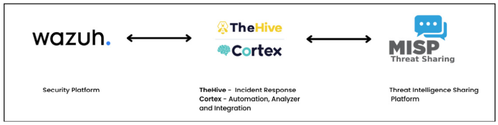
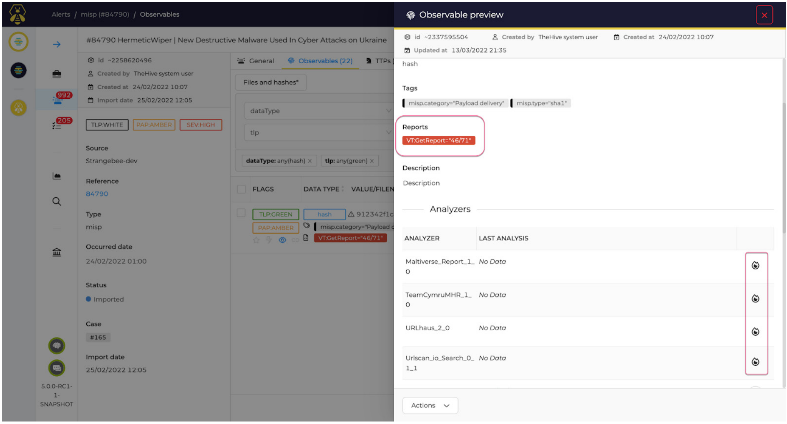
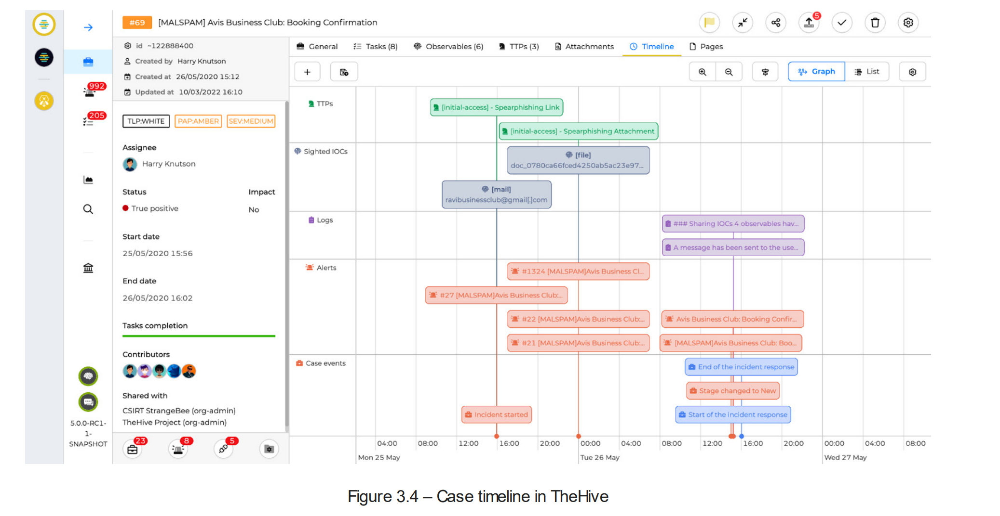
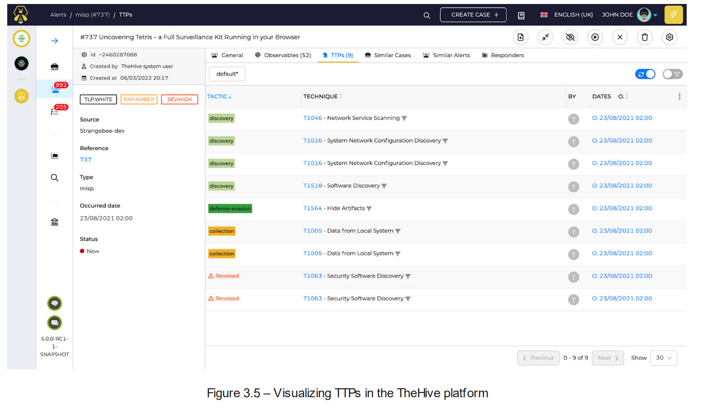
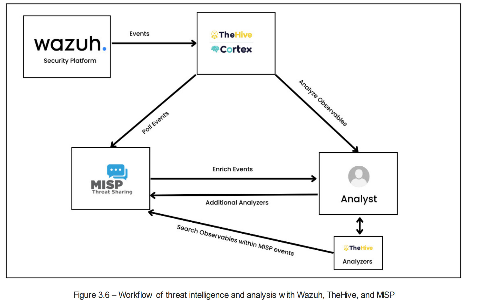
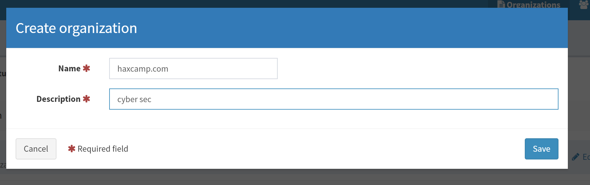
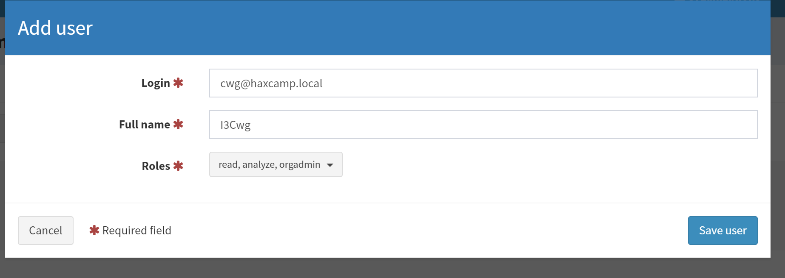

## 1. Introduction to Threat Intelligence

Threat intelligence, or cyber threat Intelligence, is basically knowledge about threat actors (an individual or group of attackers that carry out hacking campaigns against companies or government bodies), their motives, and their capabilities. Threat intelligence is all about staying on top of the latest threats and risks lurking on the internet. Threat intelligence enables us to make faster, more informed, data-backed security decisions and change our behavior from reactive to proactive in the fight against attackers. Threat intelligence helps every domain of cybersecurity, including SOC analysts, intel analysts, chief information security officers (CISOs), etc. By collecting and analyzing threat intelligence information, organizations can be empowered through early detection and prevention, informed decision-making using context, improved incident response, a better understanding of attackers’ tactics, techniques, and procedures (TTPs), better security defense against growing threats, and more. In this section, we will talk about: 

- Types of threat intelligence 
- How SOC analysts use threat intelligence

### Types of Threat Intelligence

In the constantly changing world of cybersecurity, companies that want to strengthen their defenses must stay ahead of new risks and utilize threat intelligence. Threat intelligence is mainly offered in three types: *tactical intelligence*, *operational intelligence*, and *strategic intelligence*. By using these types of threat intelligence, businesses can not only learn about how threat actors’ strategies change over time but also plan their defenses to successfully deal with cyber threats that are always changing. Let’s understand all three types of threat intelligence in detail:

- **Tactical Intelligence:** Tactical intelligence is concerned with the immediate future, is technical in nature, and identifies simple **indicator of compromise (IOCs)**. IOCs are technical information collected during investigations, threat-hunting activities or malware analyes. IOCs are actual pieces of data, such as IP address, domains, file hashes, etc. They can even be collected via open source and free data feeds such as:
    - AlienVault OTX (https://otx.alienvault.com/)
    - Abuse.ch (https://abuse.ch/) 
    - Blocklist.de (https://www.blocklist.de), 
    - Proofpoint Emerging Threats (https://rules.emergingthreats.net).

This tactical intelligence data is consumed by IT analysts and SOC analysts. It typically has a very short lifespan because IOCs such as malicious IP addresses or domain names can become obsolete in a matter of days or even hours.

- **Operational Intelligence:** Every attack has a “who,” a “why,” and a “how.” The “who” is referred to as identification. The “why” is referred to as motivation or intent. The “how” is made up of the threat actor’s TTPs. This gives the blue team or security operations team insight into how adversaries plan, conduct, and sustain campaigns and major operations. This is called operational intelligence. Tactical intelligence plus human analysis gives this intelligence a longer useful lifespan.

- **Strategic Intelligence:** Strategic intelligence assists decision-makers in understanding the threats that cyber threats pose to their organizations. With this knowledge, they can make cybersecurity investments that protect their organizations while also aligning with their strategic priorities. CISOs and management teams are the real consumers of this intelligence. Strategic intelligence requires human data collection and analysis, which requires a deep understanding of cybersecurity and geopolitics. Strategic intelligence is usually prepared in the form of reports.

Combining these different types of threat data can help businesses create complete and flexible cyber defenses against a wide range of cyber threats.

Next, we will focus on how SOC analysts can consume threat intelligence data (especially tactical and operational intelligence) for better detection and analysis of threats.


### How SOC analysts use Threat Intelligence?

In the previous section, we learned how SOC teams utilize both tactical and operational intelligence information. Threat intelligence provides valuable information about latest threats, attack methods, malicious actors, and vulnerabilities. Let's talk about the practical steps SOC analysts take to consume threat intelligence data:

1. **Gather obserables:** Observables are pieces of possible threat information. Examples include IP addresses, domain names, URLs, file hashes, email addresses, and more. Observables can be collected via SIEM tools, EDR, email security tools, open source and free threat intelligence feeds, etc.

2. **Enrichment and context:** After identifying suspicious observables, gather context and enrich the information to better understand the threat. For example, you discovered an IP address (123.45.67.89) connecting to a newly registered domain (malicious-website.com). You begin by enriching this data by searching threat intelligence databases and historical data. This IP address has previously been linked to several phishing campaigns, and the domain is hosted in a high-risk region known for cybercriminal activity.

3. **IOC creation:** On the basis of the enriched information, you generate IOCs that can be used in the future to detect similar malicious activities. For example, from the information gathered, you create the following IOCs:

      - IP address IOC : 123.45.67.89
      - Domain IOC : malicious-website.com
      - URL path IOC: malicious-website.com/steal-credentials

These IOCs are now added to the security tools in your organization, such as firewalls, intrusion detection systems, and SIEM solutions. If any of these IOCs are matched, it indicates malicious activity that warrants investigation.

4. **Detection and response:** With the enhanced IOCs in place, the security systems of your organization, such as SIEM, IDS, or XDR, actively monitor network traffic and logs for matches against these indicators. When a match is discovered, an alert is generated, and the SOC team is prompted to initiate incident response procedures. For example, an employee clicks a link that leads to the IOC-mentioned URL path (malicious-website.com/login). This triggers an alert in the intrusion detection system of your organization (e.g. Suricata). The SOC team investigates the incident after receiving the alert. They verify that the user’s computer has visited a malicious URL and may have been exposed to malware. The SOC team isolates the compromised system, initiates malware analysis, and initiates the containment and eradication processes to prevent further spread.

5. **Continuous improvement:** After the incident has been resolved, the SOC team conducts a post-incident analysis. This involves evaluating the efficacy of the threat detection process, refining the IOCs, and learning from past responses to improve future response strategies. During analysis, the SOC team determines that the phishing attempt originated from an email with a subject line referencing a fake job offer. They decide to add email subject patterns to their IOCs to detect similar phishing campaigns more effectively in the future.

***NOTE***

*IOCs are not just limited to domains, IP addresses, or URLs; they can also be file hashes, email addresses, email subjects and patterns, registry keys, network signatures (data payloads or packet headers), behavioral indicators (unusual file modification, new user accounts), custom YARA rules, user agents, HTTP headers, DNS records, SSL certificates, hosting information, etc.*


## 2. Automation in Threat Intelligence

As of now, you might have realized the importance of threat intelligence for SOC analysts or blue team. But imagine, if there are thousands of observables generated every day, it will be very difficult to manually copy/paste each observable and search them in the threat intelligence database or feeds. This brings a lot of challenges to SOC, such as delayed threat detection, missed alerts, a lack of consistency, and slow response times. In this section, we will design an automated threat intelligence system and integrate it with Wazuh. We will cover the following: 
- Designing automated threat intelligence 
- Introduction to MISP 
- TheHive and Cortex 
- The workings of threat intelligence and analysis

### Designing an Automated Threat Intelligence System

Wazuh is a security platform that collects security events from all endpoint. To integrate threat intelligence capabilities, we will use an MISP project - an open source threat intelligence sharing platform. The integration between Wazuh and MISP can be accomplished by using MISP API, as shown in the following figure:


However, the design will not allow the security team to track every observable and security incident. We need to build a system wherein we can take the security events from Wazuh and analyze the observables of each event separately against threat intelligence feeds. In short, we have three tools in this design: 
- Wazuh (security events collection) 
- A security incident management tool (for receiving alerts from Wazuh and performing a lookup with threat intelligence data) 
- A threat intelligence tool (this tool is created to provide threat intelligence data to the security incident management tool) 
- Top of Form

We will use the TheHive tool for security incident management and an MISP project for threat intelligence management. The following figure gives you an idea of the proposed integration of Wazuh with TheHive/Cortex and MISP:



This integration of Wazuh, TheHive, and MISP has some major advantages: 
- **Centralized threat intelligence**: The integration lets threat intelligence from MISP be put together in TheHive, creating a central location for Wazuh to store and analyze security events and decide what to do about them. This integration lets security teams correlate events with known risks and IOCs, which makes responding to incidents more accurate and quicker. 
- **Scalable security operations:** The integration streamlines the handling of security events, enabling scalable security operations. Through the utilization of Wazuh’s detection capabilities, TheHive’s case management skills, and MISP’s threat intelligence capabilities, organizations can effectively handle and address an increasing volume of security incidents without requiring significantly more manual effort. 
- **Automated incident response:** Although this chapter is about threat intelligence integration, by integrating TheHive, we can also accomplish automated incident response capabilities. By utilizing information from MISP, security analysts can generate response playbooks in TheHive, which enables them to provide more consistent and prompt responses to security incidents identified by Wazuh.

Let’s first quickly understand the capabilities of each of these tools. Then, we willset them up and integrate them with each other.

### Introduction to MISP

**MISP** is  an open-source threat intelligence platform that enables organizations and security professionals to collect, share, and collaborate on structured threat information. MISP has seven core layers:

- **Data layer:** This layer focuses on gathering detailed information about security incidents and threats from actual threat intelligence data. The primary components of this layer are as following:
    - **Event**: security events or threat information
    - **Attributes:** Decribes aspects of threat such as IP address, domain, hashes, email addresses, etc.
    - **Object:** A template that specifies contextualized and organized information about threats.
- **Context layer:** This layer is concerned with creating links and correlations between various pieces of threat intelligence data.
- **Correlation layer:** This layer is responsible for identifying patterns and correlations between various events and properties.
- **Warning list layer:** Warning lists are collections of indicators that are considered to be malicious or suspicious.
- **Taxonomies layer:** : Taxonomies standardize threat intelligence data categorization and classification. They aid in the consistent and orderly organization and description of threats.
- **Galaxies layer:**  Galaxies are groups of connected information regarding various threats, such as threat actors, methods, malware families, and so on. They provide contextual information to help you understand dangers better.
- **Feed layer:** Feeds entail incorporating external threat intelligence sources into MISP. This layer enables MISP to
automatically retrieve and incorporate data from a variety of reliable sources, thereby enhancing the threat intelligence database.

As we discussed earlier, we need TheHive as a broker that accepts the security alerts from Wazuh and allows us to analyze each observable against MISP threat intelligence data. 

TheHive consists of two tools: TheHive for incident management and Cortex for integration with tons of threat intelligence platforms. TheHive and Cortex constitute a potent integration designed for SOC analysts. This integration bridges the gap between effective collaboration and advanced threat analysis, thereby enhancing the SOC’s ability to identify, mitigate, and respond to cybersecurity threats.

### TheHive

**TheHive** is an incident response platform designed to help SOC analysts analyze security alerts and incidents. It facilitates collaboration and information sharing among different team members during security investigations and incident responses. Some of the important capabilities of TheHive are as follows:

- **Observable  analysis:** TheHive can analyze the alerts received from Wazuh, and this enables SOC analysts to pre-qualify alerts before deciding whether to ignore them or convert them into cases.  



- **Case timeline:** A case timeline illustrates the entirety of the case’s lifecycle, including initial alerts, ongoing and completed tasks, identified IOCs, and much more



- **Integration** theHive version 5 has strong and default integration capabilites with Cortex, Wazuh, MISP. However, it can also be integrated with IBM QRadar, Splunk, Elasticsearch, VirusTotal and other SIEM tools.
- **Alert TTPs:** TheHive can contain a set of MITRE ATT&CK TTPs with ATT&CK mapping post-integration with MISP. MITRE ATT&CK is a framework that categorizes the tactics, techniques, and procedures used by threat actors during cyberattacks.



TheHive and Cortex are made to work together without any problems. TheHive can send observables from incidents to Cortex so that the preset analyzers can look at them. Some jobs can be automated with this integration, which cuts down on the amount of work that needs to be done by hand in the incident response process. Let’s explore the capabilities of Cortex.

### Cortex

Cortex is a part of the TheHive project. It automates threat intelligence and response, providing SOC analysts with the ability to detect and respond to threats quickly and effectively. One of the core features of Cortex is its ability to integrate severalsecurity tools, threat intelligence feeds, security services, and more. Cortex serves as a central repository for this intelligence, allowing analysts to manage and access the information they require with ease.

Cortex has two major components:

- **Analyzers:** Analyzers gather and enrich data from various sources to help SOC analyst teams. There are many types of analyzers that connect to online security services, threat feeds, and databases. After transforming the data, the analyzer can enrich it by checking it against a list of known malicious indicators, querying online services for more information, or running custom scripts for more advanced analysis.
- **Responder:** Responders are used for acting in accordance with the enriched data supplied by the analyzers. Responders come in a variety of forms, each intended to carry out a particular task, such as blocking an IP address, isolating an infected device, or alerting a security analyst.


### Understanding the Workings of Automated Threat Intelligence

The final design workflow involves all three components: Wazuh, TheHive/Cortex, and MISP. This recommended design helps enterprises build an effective and scalable incident response system. Some of the important steps involved in this automated threat intelligence and analysis design with Wazuh, TheHive/Cortex, and MISP are as follows:

- **Event transfer:** Post-integration, TheHive can receive the security events from Wazuh. We can also configure Wazuh to send only specific types of alerts, such as security alerts matching rule level three or higher.
- **Alert triage:** Once the alert is received from Wazuh by TheHive, it can invoke Cortex to immediately look at the observables that are linked to it. This can include things such as running security scans, comparing observables to MISP threat intelligence feeds, or getting more information from the internet.
- **Response action:** TheHive can initiate response actions based on Cortex analysis results, such as altering the status of an event, providing tasks for analysts, or generating reports. It helps in the automation of portions of the incident response workflow.



Now that we have learned the entire flow of automated threat intelligence, incident management, and analysis, let’s begin to set up Wazuh, TheHive/Cortex, and MISP tools and integrate them to work seamlessly.

## 3. Setting up TheHive and Cortex

The deployment design of TheHive provides companies with flexibility by allowing for both standalone server deployments (deployment on a single server) and clustered deployments (multiple servers work together to handle the TheHive application load). It is recommended to use cluster mode deployment for large production environments. Some of the software components of TheHive are as follows:

- **Apache Cassandra:** TheHive utilizes the Apache Cassandra database to store its data. Cassandra is a distributed NoSQL database known for its scalability and capability to manage massive amounts of data across a cluster of numerous nodes. Cassandra is utilized within the framework of TheHive to store data pertaining to cases, incidents, and other pertinent information.
- **Elasticsearch:** TheHive uses Elasticsearch for indexing. It is a powerful analytics and search engine that makes data indexing, querying, and searching more effective. It improves TheHive’s search performance and speed, which makes it simpler for users to find and evaluate data.
- **S3 MINIO:** When a clustered deployment is necessary or when organizations need scalable and distributed file storage, TheHive provides support for S3-compatible storage solutions such as MINIO. AWS provides a scalable object storage, called S3 (Simple Storage Service). An open-source substitute called MINIO is compatible with the S3 API.

The TheHive application, database, index engine, and file storage can be run separately so each layer can be a node or cluster. TheHive could be set up in a complex clustered architecture using virtual IP addresses and load balancers.

We can set up TheHive and Cortex in different environments, such as Ubuntu servers, Docker, Kubernetes, etc. To simplify the installation process, we are going to use Docker Compose. We need to take the following steps:
 
### Installing dockercompose

Verify whether the Docker daemon service is running:
``` js
sudo systemctl status docker
docker.service - Docker Application Container Engine
     Loaded: loaded (/lib/systemd/system/docker.service; enabled; vendor preset>
     Active: active (running) since Mon 2025-03-17 16:07:33 +07; 4min 18s ago
TriggeredBy: ● docker.socket
       Docs: https://docs.docker.com
   Main PID: 9900 (dockerd)
      Tasks: 11
     Memory: 28.0M
        CPU: 568ms
     CGroup: /system.slice/docker.service
             └─9900 /usr/bin/dockerd -H fd:// --containerd=/run/containerd/cont>

Thg 3 17 16:07:33 VM dockerd[9900]: time="2025-03-17T16:07:33.036033144+07:00" >
Thg 3 17 16:07:33 VM dockerd[9900]: time="2025-03-17T16:07:33.358971216+07:00" >
Thg 3 17 16:07:33 VM dockerd[9900]: time="2025-03-17T16:07:33.387045206+07:00" >
Thg 3 17 16:07:33 VM dockerd[9900]: time="2025-03-17T16:07:33.387209921+07:00" >
Thg 3 17 16:07:33 VM dockerd[9900]: time="2025-03-17T16:07:33.422330552+07:00" >
Thg 3 17 16:07:33 VM dockerd[9900]: time="2025-03-17T16:07:33.428941170+07:00" >
Thg 3 17 16:07:33 VM dockerd[9900]: time="2025-03-17T16:07:33.429250520+07:00" >
Thg 3 17 16:07:33 VM systemd[1]: Started Docker Application Container Engine.
Thg 3 17 16:07:56 VM dockerd[9900]: time="2025-03-17T16:07:56.881834422+07:00" >
Thg 3 17 16:08:02 VM dockerd[9900]: time="2025-03-17T16:08:02.750864677+07:00"
```

Check the Docker Compose version by running the following command:
```bash
docker-compose --version
docker-compose version 1.29.2, build unknown
 ```

If the Docker installation is good, you should see the output with the Docker compose version, OpenSSL version, CPython version, etc.

### Prepare the YML script for the TheHive module

The primary distinction between docker run and docker-compose is that docker run is entirely command line-based, whereas docker-compose reads configuration data from a YAML file. So, the beauty of Docker Compose is that we can install all the modules of TheHive with a single YML script, and once this YML script is executed by Docker, all the modules will be turned up. Now, let’s prepare our TheHive YML script:

1. **Create new dic:**  To keep our project organized, let’s create a new directory named theHive and change the directory:

``` bash
mkdir theHive
cd theHive
```

2. **Create a docker-compose file:** The docker-compose.yml is a configuration file that allows us to configure and launch multiple Docker containers within a single file. Let’s create a docker-compose.yml file with the code shared in the GitHub repository at https://github.com/PacktPublishing/Security-Monitoring-usingWazuh/blob/main/Chapter%203/theHive_Docker_Compose.yml.

``` bash
 wget https://raw.githubusercontent.com/PacktPublishing/Security-Monitoring-using-Wazuh/refs/heads/main/Chapter%203/theHive_Docker_Compose.yml
```

3. **Build**

``` bash 
mv theHive_Docker_Compose.yml docker-compose.yml
docker-compose up -d
```

Wait for a few minutes for the TheHive and Cortex modules to be installed. Once the installation is complete, you can access TheHive and Cortex by opening a web browser and navigating to http://localhost:9000 for TheHive and http://localhost:9001 for Cortex.

The default username and password for TheHive and Cortex are admin@thehive.local and secret.

Next, Cortex doesn’t provide default credentials; you have to reset the database and set a new username and password. These will be our default admin credentials.

Once you have admin credentials for both theHive and Cortex, we will create an organization and a user under it and generate an API key.


### Creating an Organization and Users on TheHive

Once you’re logged in, we need to do a few things. We need to first create an organization and then a user:
1. To create an organization, go to **Organization** and click **Add**. Enter a **Name** and **Description** and set the tasks sharing rule to **Manual**.

2. Next, create two users for the haxcamp organization—a user and an API user. Go to **Users** and click **Add** to create a normal user account. Enter the following:

### Creating an Organization and Users on Cortex





## 4.  Setting Up MISP

MISP is an open source software and there are different ways we can install it to build our own threat intelligence and share it with the community. MISP can be installed on most Linux distributions, and the MISP community has created simple installscripts. MISP has many dependencies and combines various software to function properly. This is also known as the LAMP stack:
- Linux operating system
- Apache for web server
- MySQL relational database
- Miscellaneous—PHP, Perl, Python

We can deploy MISP in different environments (https://www.misp-project.org/download/), such as Docker, VirtualBox VM, and VMware VM. Deploying MISP and its dependencies via Docker is by far the simplest installation process I’ve found. VirtualBox VM and VMware VM are good for lab and testing environments. Take the following steps to set up MISP:


### System Requirements
### Installing Docker and Docker Compose
### Setting Up and Launching MISP
### Adding Organizations and Users
### Adding Feeds


## 5. Integrating Wazuh with TheHive

### Installing TheHive Python Script on Wazuh Manager
### Creating an Integration Python Script on Wazuh Manager
### Creating a Bash Script on Wazuh Manager
### Integrating TheHive Server in Wazuh Server Configurations
### Restarting and Testing
### Visualizing Alerts on TheHive

## 6. Integrating TheHive and Cortex with MISP

### Integrating TheHive with Cortex
### Integrating Cortex with MISP
### Integrating TheHive with MISP

## 7. Use Cases
### Reviewing Alerts
### Creating a Case
### Analyzing File Observables
### Analyzing Network Observables
### Managing TTPs
