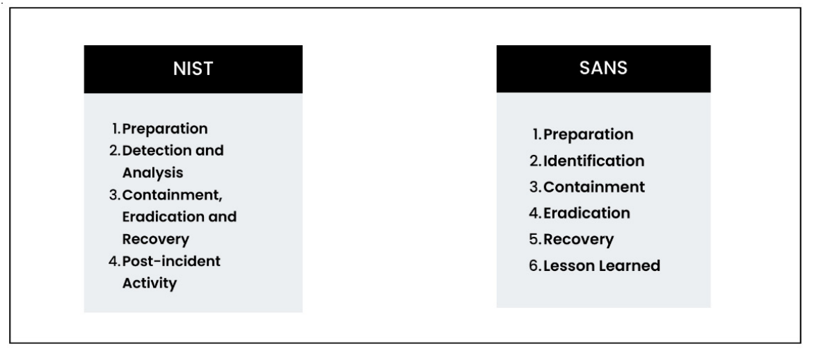

It is utmost importance to have a rapid and efficient response plan in place to handle any security events that may arise in the ever-changing world of cybersecurity. For example, a sales employee opened up a malicious file with a name attached to an email pretending to be from an authorized business partner. This can result in a ransomware attack and bring down many mission-criticalservices. When such an incident happens, responding promptly can help to minimize the overall damage to the network. An efficient incident response (IR) can help businesses to promptly resume normal operations, thereby reducing the amount of downtime that occurs and the expenses connected with it.

In this chapter, we will learn how to leverage the Wazuh platform and other Wazuh-supported thirdparty tools to build an effective IR system. We will cover the following topics in this chapter:
- Introduction to incident response
- What is Wazuh active response?
- Blocking unauthorized SSH access
- Isolating an infected Windows machine
- Blocking RDP brute-force attack attempts

## 1. Introduction to Incident Response

Incident response is the process by which an organization handles a security incident, DDos attack, or data breach. It is an effort to immediately identify an attack, mitigate the impact of the attack, contain any damage caused by the attack, and fix the cause in order to reduce the risk of future attacks. In practice, IR refers to a collection of information security rules, processes, and tools that can be used to detect, contain, and remove intrusions.Let’s discuss the two most popular IR frameworks, the **National Institute of Standards and Technology (NIST) and SANS**, as shown in the following diagram.

### Different Incident Response Methods

There are various methods for developing a structed IR process. There are two IR frameworks and processes that are most popular: NIST and SANS. Let us see each of them in detail.

#### SANS six-step incident response process

The SANS Institute recommends six precesses for IR: *preparation, indentification, containment, eradication, recovery, and lessons learned.*

Let’s elaborate on the SANS six-step procedure. SANS defines IR as having six stages. When an incident occurs, these six processes are repeated in a cycle. The steps are as follows:
1. Preparation of systems and procedures
2. Identification of incidents
3. Containment of attack
4. Eradication of intrusion
5. Recovery from accidents, including system restoration
6. Lessons gained and feedback applied to the next stage of planning

Let us understand each of these steps in detail.

1. **Preparation:** During the first step of preparation, you evaluate the efficiency of exitsting security measures and regulations. This entails doing a risk assessment to identify current vulnerabilities and the priority of your assets. Some of the important action items are listed here:
- Create a policy and plan for IR
- Create a team for IR
- Determine and categorize important assets
- Acquire the tools and technologies needed for IR

2. **Indentification of incidents:** The emphasis is on the constant monitoring and identification of potential security issues using techniques such as IDSs, SIEM, EDR, and log analysis. SOme of the important action items are listed here:
- Continuous suveillance for indications of security incidents
- Use host-based and network-based intrusion detection systems
- Gather and examine logs from various sources
- Make use of threat intelligence streams

3. **Containment of attack:** When an incident occurs, this phase focuses on immediately isolating compromised systems, implementing temporary solutions or workarounds, and updating access restrictions and firewall rules to avoid additional compromises. This is where digital forensics plays a crucial role.

4. **Eradication of intrusion**: The incident’s root cause is recognized and treated here. Vulnerabilities that allowed the incident to occur are remedied, and policies and configurations are modified to prevent the same occurrence from occurring again.
5. **Recovery from accidents, including system restoration:** This phase focuses on resuming the normal operation of affected
systems, certifying their integrity, and ensuring that the incident has been thoroughly resolved. It also entails analyzing and upgrading IR processes depending on the incident’s lessons gained.
6. **Lessons learned phase:** During this phase, organizations undertake a post-event review, documenting the incident, the reaction, and the lessons learned. The purpose is to develop IR plans and policies, as well as to offer IR team members additional training.

#### NIST incident response process

NIST defines IR as having four steps: preparation, detection and analysis, containment, eradication, and recovery, and post-incident activity. Let us understand each of these processes in detail:

1. **Preparation:** The NIST framework for IR emphasizes preparation as a critical component, much like the SANS framework does. During this phase, systems, procedures, and plans must be put in place in order to get ready for incidents. Organizations should have the following in place to be ready for incidents:
- A precise IR strategy
- Clearly defined roles and duties
- A successful communication strategy
- Reporting plan
- Determining the vital systems and resources
- Testing and updating the IR plan on a regular basis

2. **Detection and analysis:** During this phase, companies identify and examine occurrences to comprehend their extent and consequences. Making decisions regarding how to respond to an incident at this time is crucial. The following should be in place inside businesses in order to recognize and analyze occurrences effectively:
- Keeping an eye on escalation processes and mechanisms
- Prompt incident detection and analysis

3. **Containment, eradication, and recovery:** : The containment, eradication, and recovery stages in the NIST framework are similar to those in the SANS framework. The following should be in place inside organizations in order to contain, eliminate, and recover from incidents:
- Isolating the impacted systems
- Eliminating the incident’s root cause
- Returning to regular operations

4. **Post-incident activity:** In the NIST system, post-incident activity is the last phase. Organizations evaluate their IR procedure and evaluate the effects of incidents at this point. The following should be in place for organizations to examine and enhance the IR process:
- A procedure to evaluate the incident method
- A process for recording the lessons discovered
- A plan for bringing enhancements to the IR procedure into practice

#### Objectives of the NIST and SANS procedures

The objectives of the NIST and SANS IR frameworks are similar and offer an organized method for handling incidents. Nonetheless, the two frameworks differ in a few significant ways:
- Both frameworks emphasize the significance of having a precise IR plan, defined roles and duties, and efficient communication
when it comes to the preparation stage. On the other hand, having a reporting plan in place and identifying key systems and
assets are given more weight in the NIST framework.
- Both frameworks concentrate on the prompt detection and examination of occurrences in terms of detection and analysis. But whereas the NIST framework is more concerned with monitoring systems and escalation protocols, the SANS approach prioritizes triage and prioritizing.

### Incident Response Automation

Effective IR is time-sensitive and requires teams to identify threats and initiate an incident response plan (IRP) as soon as possible. A security team receives thousands of security alerts from security tools every day and hence it is difficult to manually analyze events or assess every alarm that security tools generate. These constraints are addressed via automated IR. In Chapter 4, Security Automation and Orchestration Using Shuffle, we learned how shuffle SOAR makes this possible by creating workflows, helping the security team with automated incident enrichment, automated observable analysis with TheHive tool integration, automating Wazuh activities, and many more. In this chapter, our focus will be on using Wazuh’s in-built capability called active response to perform IR. In general, IR automation can help the security team with the following:
- **Immediate containment:** Once compromised systems are identified, automated IR systems should isolate them to stop threats from spreading.
- **Dynamic firewall rules:** In response to certain risks, the IR automation system can dynamically develop and deploy firewall rules that block malicious traffic or isolate vulnerable systems
- **Automated account disabling:** Automated reaction steps can quickly disable compromised user accounts in the case of a security incident, blocking future unauthorized access
- **User access restrictions:** To improve the security posture, the IR automation system can impose access controls, such as
removing users who indicate suspicious behavior or restricting access privileges
- **GeoIP blocking:** To strengthen defense against targeted attacks, automated IR can use GeoIP blocking rules to limit access from particular geographic regions known for malicious activity

We can create tons of different use cases for automating IR. In the next section, we will practically deploy and test some of the automated IR using Wazuh’s active response capability.

## 2. Wazuh Active Response

One of the main component of the Wazuh platform that enables automatic response to security event and incidents is called active response. Security analysts can respond quickly to specific security threats or triggers identified by the Wazuh system by utilizing active response. By utilizing active response features, Wazuh enables organizations to respond to security incidents quickly and aggressively. With Wazuh active response, you may develop and execute automated responses against most security alerts. These responses may include executing custom scripts, banning IP addresses, or deactivating user accounts. Automating response actions makes sure that incidents with a high significance are dealt with and mitigated in a timely and consistent way. This is especially helpful when security teams don’t have a lot of resources and have to decide how to respond first. 

In this section, we will cover the following topics:
- Active response scripts
- Configuring active response
- The working of Wazuh active response

### Active Response Scripts

Wazuh provides pre-built Active response scripts for Linux, Windows, and macOS systems. Additionally, it also helps security professionals to write custom active response scripts based on specific requirements. The default active response scripts are stored in the following folders/directories:

| Endpoint Location | Directory/Folder                              |
|--------------------|-----------------------------------------------|
| **Windows**        | `C:\Program Files (x86)\ossec-agent\active-response\bin` |
| **Linux**          | `/var/ossec/active-response/bin`             |
| **macOS**          | `/Library/ossec/active-response/bin`         |

The Wazuh team and entire community have done a brilliant job in building powerful active response scripts. Some of the most popular active response scripts are:
 

| **Operating System** | **Scripts** |
|----------------------|-------------|
| **Windows**          | - **Netsh.exe**: Blocks an IP address using `netsh`    - **Restart-wazuh.exe**: Restarts the Wazuh agent    - **Route-null.exe**: Adds an IP address to the null route |
| **Ubuntu**           | - **firewall-drop**: Adds an IP address to the IP tables deny list    - **start.sh**: Restarts the Wazuh agent or manager    - **Route-null**: Adds an IP address to a null route |

Now, let's learn how to set up active response on the monitored endpoints.

### Configuring Active Response

### How Wazuh Active Response Works
## 3. Blocking Unauthorized SSH Access
### Lab Setup
### Setting Up Wazuh Active Response
### Testing and Visualizing Alerts
## 4. Isolating a Windows Machine Post-Infection
### System Requirements
### VirusTotal Integration
### Setting Up a Windows Machine with a Batch and PowerShell Script
### Configuring Active Response in Wazuh
### Testing and Visualizing Alerts
## 5. Blocking RDP Brute-Force Attacks
### System Requirements
### Setting Up a Windows Agent with an Active Response Script
### Setting Up Wazuh Server with a Brute-Force Attack Rule and Active Response Script
### Testing and Visualizing Alerts
## 6. Summary